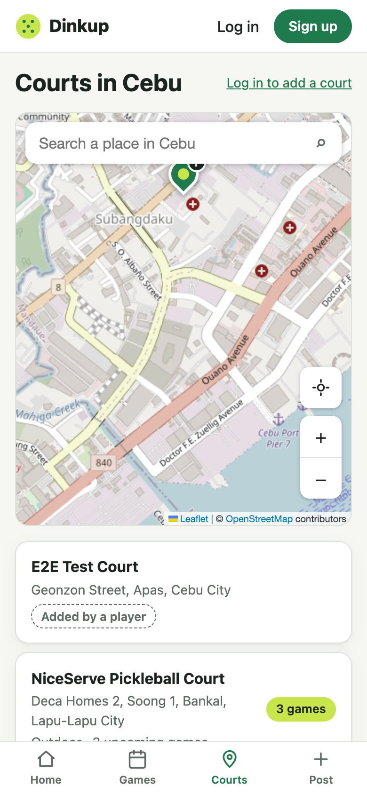
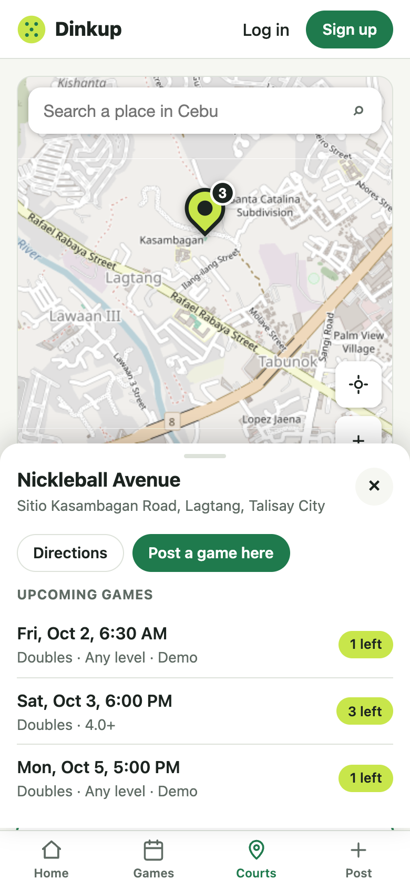
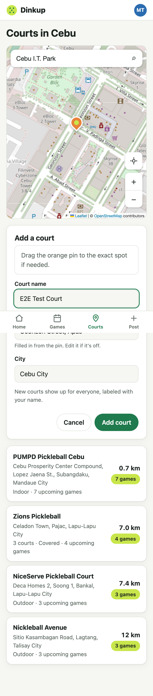
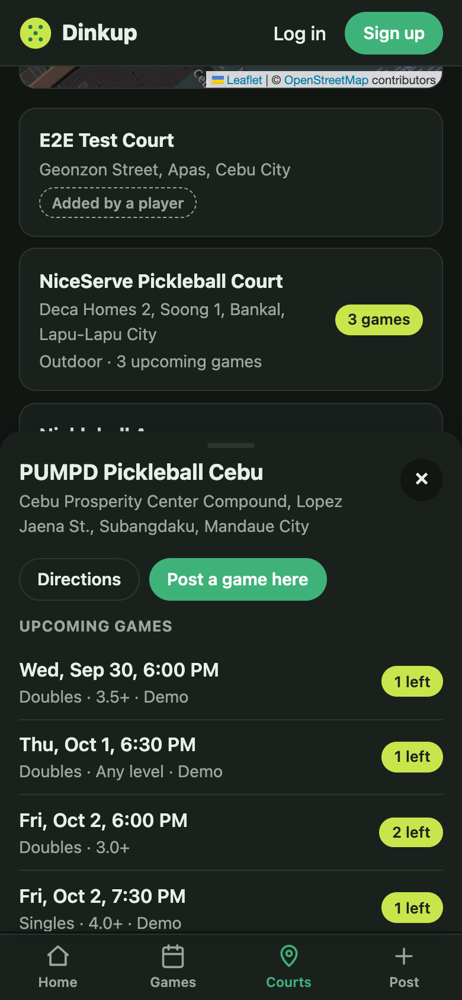
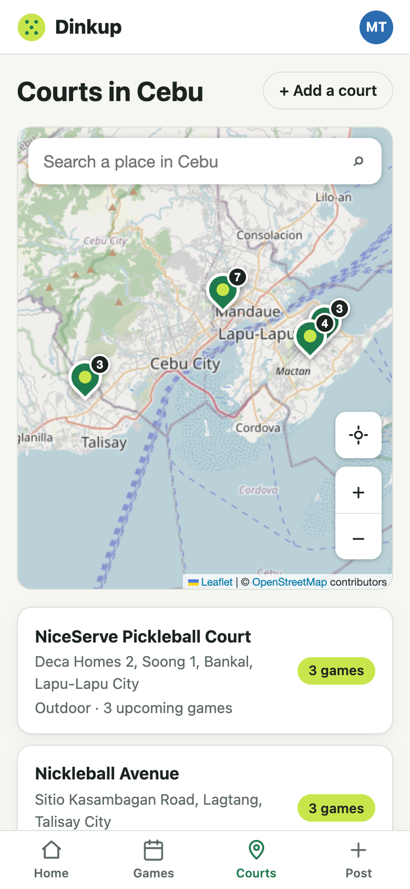

# Change 1: Any court, friendlier maps, games on the map

> **Update:** the map engine and tiles were replaced in [change 2](change-2-maplibre.md) (MapLibre + OpenFreeMap), and search moved to Photon with pasted Google Maps links. The court features below are unchanged.

**Date:** 2026-09-30 (after launch)

## Prompt

> when it comes to location, the user can select any court they know, also can you change the maps ui? the user friendly. also what ever posted each of that location must be view in maps select as well

The AI asked two questions: who sees new courts (unanswered, so it went with the recommended "everyone, labeled") and which map improvements to make (all four were chosen).

## What was built

**Players can add any court**
- Players tap the map, search for the place, or tap an existing pin while adding. The orange draft pin can be dragged.
- The address fills itself in from the pin (reverse geocoding) unless the player typed their own.
- **"Is it one of these?"** lists existing courts within 150 m. The server rejects anything within 50 m with a 409 and points to the existing court.
- The court is **public right away, labeled "Added by {name}"**, with a blue pin to set it apart from curated courts.
- Rules: real accounts only (demo visitors are refused), 5 new courts per player per day, and inside the Cebu area (Cebu island, Mactan, Bantayan, Camotes).
- The player who added a court can fix its name or pin (`PATCH /api/courts/:id`). Curated courts can't be edited from the app.
- Available from the Courts page (**+ Add a court**) and the Post a game form (**Can't find your court? Add it**).

**Friendlier map**
- Bigger 40 px pins with a **game-count badge**. The selected pin grows and turns lime.
- **Bottom sheet** when a pin or list item is tapped: name, address, distance, who added it, Directions, **Post a game here**, and the court's upcoming games. It sits above the tab bar on phones, as a floating panel on desktop, and closes with Escape or ×.
- **Locate me** and **zoom** buttons (44 px tap targets) and a **place search** box.
- A softer light map and a real dark "night" map.

**Games visible per location**
- `GET /api/courts` now includes each court's `upcomingGames`. `GET /api/games?court=<id>` lists one court's games.
- On the Courts page, the sheet shows that court's games. On the Games map, badges count the *filtered* games and the sheet lists them.
- On Post a game, **"Already booked here"** shows the chosen court's games so hosts can avoid a clash.

15 new tests (99 total).

## Decisions worth explaining

- **The geocoding proxy (`/api/geo/search`, `/api/geo/reverse`).** Nominatim's usage policy requires an identifying User-Agent, at most 1 request per second, no autocomplete, and caching. Phones can't be trusted to follow that, so the server does it: a global 1.1 s request queue, a 24-hour cache (reverse lookups rounded to about 11 m), a per-IP limit of 20 a minute, and search only on Enter. Tests use a fake instead of the real service and check the User-Agent, the Cebu-bounded query, caching, and the 1-second spacing.
- **Public-but-labeled instead of approval.** It keeps the feature useful on day one. The guards (real accounts, dedupe radius, daily cap, Cebu bounds, edit-by-owner) cover the likely abuse, and approval can be added later without a schema change.
- **`ON DELETE SET NULL` for `added_by_id`.** If a player deletes their account, the court they added stays for everyone else.

## What had to be fixed

- **The "cleaner" CARTO basemap requires an API key now.** Every tile was an "API KEY REQUIRED" placeholder, at every zoom, for both styles, with or without a Referer. The automated check had only confirmed that the tile URLs pointed at CARTO, not what came back. The fix went back to keyless OpenStreetMap tiles with a CSS filter (muted in light mode, inverted for a dark map), and the test now checks tile **content**: responses must differ. It saw 39 distinct sizes out of 40 tiles.
  
- **Nested forms.** The map's search box was a `<form>`, and on Post a game the map sits inside the game `<form>`. That's invalid HTML, and Enter could submit the wrong form. The search is now a plain input that handles Enter itself, and Enter inside the add-court panel saves the court. The browser test confirms Enter in the search doesn't submit the game.
- **Tapping an existing pin while adding a court did nothing.** It now means "here": the draft pin moves onto it, which triggers "Is it one of these?" (0 m away).
- **Selecting a court from the list left the map scrolled off-screen**, so the sheet opened with no visible pin. The list now scrolls the map back into view.
- **The pin hid under the search box on small phones.** The upward nudge that keeps it above the sheet was fixed at 130 px. It now scales with the map's height, and the pin was checked visible at 390 and 320 px.
- **Test cleanup would have orphaned pins.** Deleting a test user sets its courts' `added_by_id` to null, leaving them on the map. Cleanup now deletes the courts first and refuses to run anywhere but the dev branch.
