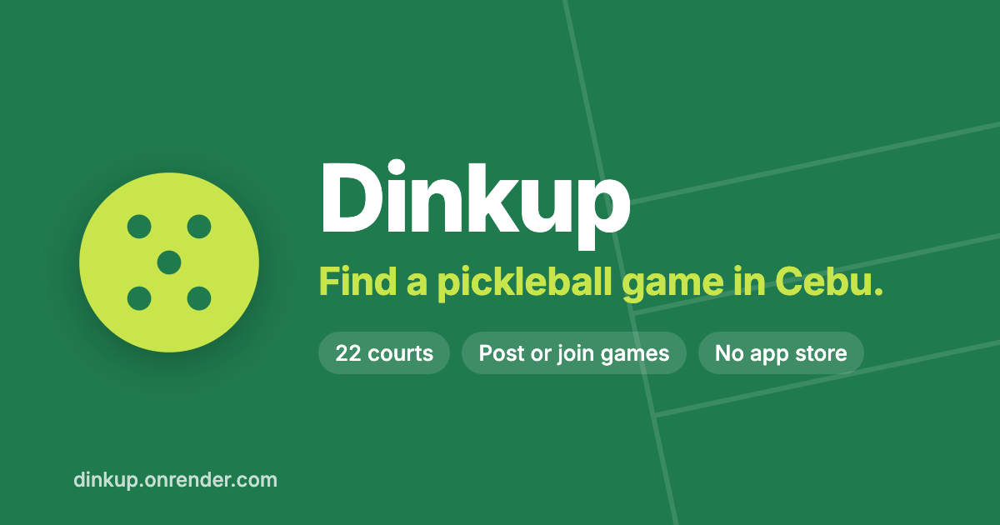

# Change 11: A real link-preview image

**Date:** 2026-10-02 (after launch)

## Prompt

> go with 4-8 improvements for now

Item 6. [Change 5](change-5-install-link.md) added link-preview tags, but the only image was the square app icon, which Messenger and Facebook show as a small thumbnail.

## What was built

A **1200×630 preview image**, the size Facebook and Messenger use for a large preview card:

- Dinkup's green and lime, the ball logo, the tagline, and three short facts ("22 courts", "Post or join games", "No app store"), with faint court lines behind.
- **Made from HTML, not a design tool.** The source is `docs/og-image.html`, rendered to PNG at exactly 1200×630 with Playwright, using the Inter font (loaded and checked before the screenshot). To update it (for example, a new court count), edit the HTML and re-render.
- **Tags:** `og:image` now points at `/og-image.png`, with its width, height, and alt text, plus `og:url`. Twitter/X uses `summary_large_image`.
- **Not part of the offline download.** The app's service worker pre-downloads every PNG, but this one is only for chat-app previews, so it's excluded. The build output confirms it isn't in `sw.js`.

## To check after deploying

Facebook caches previews. After the deploy, paste `https://dinkup.onrender.com` into the [Sharing Debugger](https://developers.facebook.com/tools/debug/) and choose **Scrape Again**, so Messenger stops showing the old icon.
