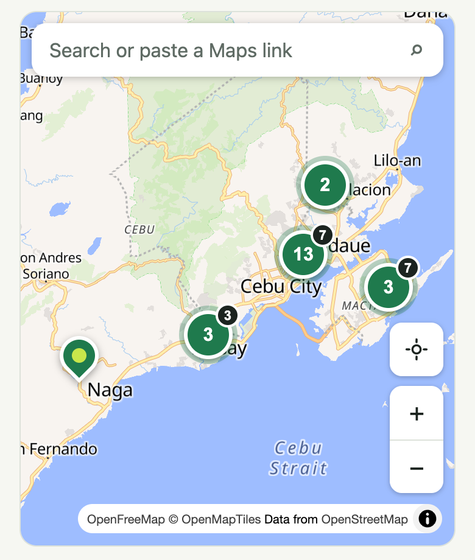
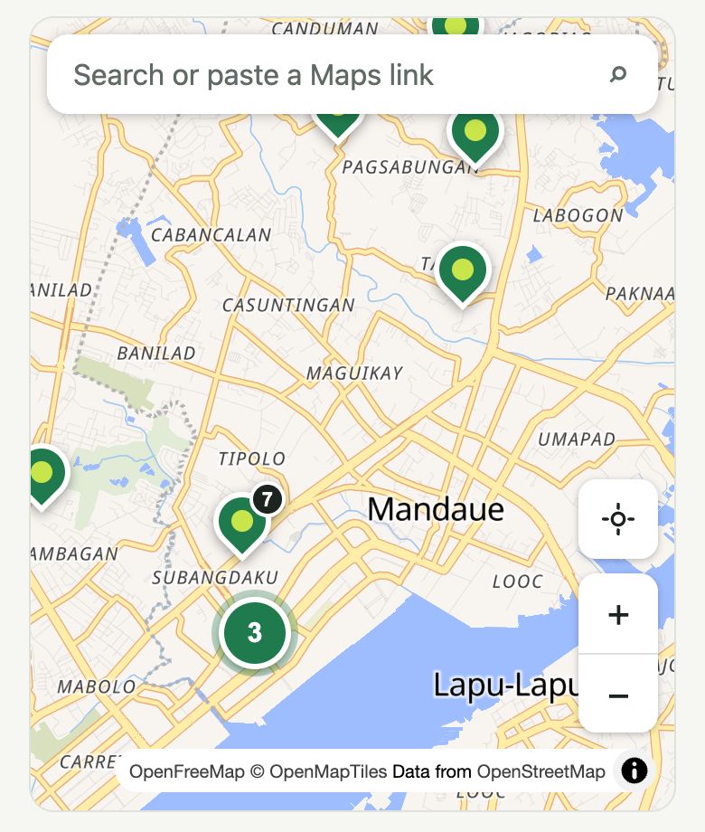

# Change 12: Overlapping pins become numbered bubbles

**Date:** 2026-10-02 (after launch)

## Prompt

> go with 4-8 improvements for now

Item 4. With 22 courts, the pins in Cebu City and Mandaue piled on top of each other at the default zoom (Royall and Rocket Pickle are 120 m apart), so some couldn't be tapped.

## What was built

- **Pins closer than 44 px on screen merge into a bubble** showing how many courts it holds. Its badge shows their total upcoming games, so the "games on the map" view from change 1 isn't hidden.
- **Tapping a bubble zooms in** until its courts separate. Bubbles are buttons, so keyboard Enter works too, and the label names the courts ("13 courts here: Andot Pickle Court, DH Sports Hub, …. Zoom in").
- **From zoom 16 on, nothing merges**, so courts at the same spot stay reachable.
- **The selected court always keeps its own pin**, for example when it's opened from search, from the list, or from a `?court=` link.
- Regrouping runs after every pan, zoom, and resize, on the Courts, Games, and Post a game maps.

## Why not MapLibre's built-in clustering

MapLibre clusters points drawn *by the map* (GeoJSON layers). Dinkup's pins are HTML buttons: keyboard-focusable, with game-count badges and the selected and "added by a player" styles. Switching would have meant rebuilding all of that and losing accessibility. Instead, a small function (`groupNearby` in `shared/src/cluster.ts`, no library) groups the pins' **screen positions**. For a few dozen pins that's instant.

## What had to be fixed

- **Bubbles still overlapped at first.** The first version grouped each pin with its neighbours in one pass. But a bubble is drawn at the *middle* of its courts, which can land right next to another bubble: the browser test measured two markers 36 px apart, and markers are 40 px wide. The function now keeps merging groups whose middles are still too close, until every marker is at least 44 px from every other. A unit test checks that on 40 scattered points; the browser check after the fix found no overlapping markers.
- **The test script itself had to change:** it waited for the first pin to be *visible*, but that pin was now hidden inside a bubble, which is the point. It now waits for the pins to exist.

## How it was checked

| Check | Result |
|---|---|
| Default Courts view | 1 pin + 5 bubbles (13, 2, 3, 3, 3), all 22 courts accounted for |
| Tap the 13-bubble | Zooms to Cebu City and Mandaue: 9 pins + 4 smaller bubbles |
| Select Royall from the list (it was inside a bubble) | Its pin shows |
| Keyboard: focus a bubble, press Enter | Zooms in |
| Games map, 320 px dark | Works, no errors |

5 unit tests for `groupNearby`.
