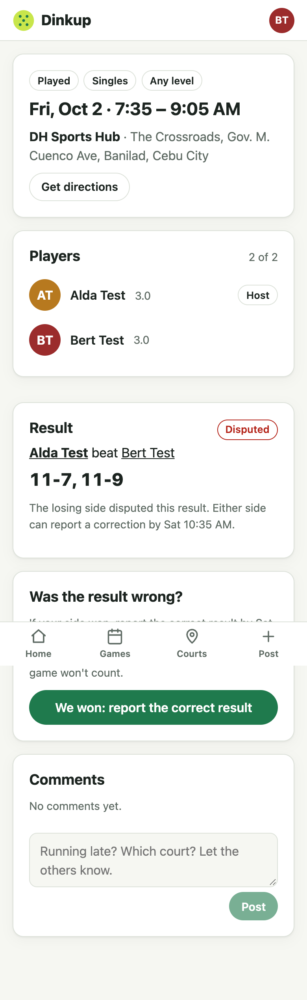
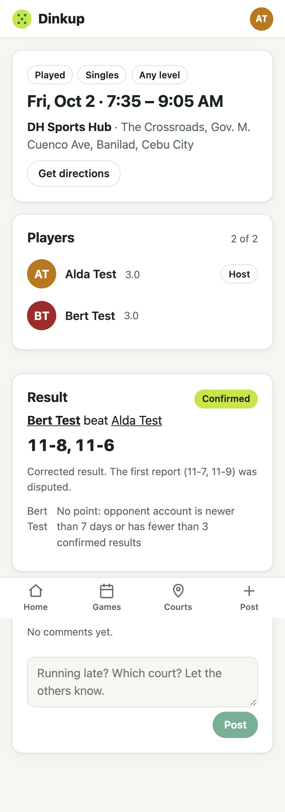

# Change 13: One correction after a dispute

**Date:** 2026-10-02 (after launch)

## Prompt

> go with 4-8 improvements for now

Item 8. In step 10, **disputes were final**: one "Dispute" tap and the game counted for no one, even when the disagreement was just a typo in the score or the wrong partner picked in doubles. The AI asked how corrections should work, and the developer picked the recommended **"one correction, then final"**.

## The rule

1. A loser disputes a result.
2. **Within 24 hours**, any player of that game who was on the **winning side of the corrected result** reports the correct result. It can name different winners, a different score, or the same claim again.
3. It goes back to **pending**, and the other side **confirms** it (points work exactly as before) or **disputes again**, which is final.

Winners report and losers confirm, as with every result, so all of step 10's guards (the confirm lock, the anti-boosting rules, expiry) apply to corrections unchanged. A single retry stops two players from going back and forth forever.

## What was built

- **`POST /api/results/:id/correct`**, in a transaction that locks the result row, the same as confirm and dispute. It checks that the result is disputed, hasn't been corrected yet, and is within 24 hours of the dispute. The sides are checked with the same function the first report uses (exactly the game's players, the right number per side, and the reporter on the winning side). The function was moved out of the report route so the two can't drift apart.
- **The result row is reused.** The players are replaced, the confirm window starts over, and two new nullable columns (`corrected_at`, `original_score`) record what was disputed. The migration only adds those two columns, so it's safe on the live database.
- The API returns `correction` (the original score) and `correctableUntil` (the deadline while a correction is possible).
- **UI:**
  - On a disputed result, players see "Either side can report a correction by Sat 10:35 AM" and a **"Was the result wrong?"** card. It reuses the report form ("We won: report the correct result").
  - A corrected result says "Corrected result. The first report (11-7, 11-9) was disputed."
  - The dispute warning now explains what happens: one correction possible, or final if this already *is* the correction.

## How it was checked

4 new API tests (22 in the results suite):
- The real winner corrects. The reporter can't confirm their own correction, the new loser confirms, and the points go to the right player.
- One correction only: a second dispute is final, and a second correction gets 409 "already corrected once".
- Corrections only work on disputed results, within 24 hours, with the game's players, by the corrected winning side, with a valid score.
- Doubles with a different partner split: the new winners get the points.

In the browser, on dev with two throwaway `e2e-` accounts:
1. Alda reports a win, and Bert disputes.
2. Bert sees the correction card and reports 11-8, 11-6.
3. Alda confirms, and the card shows the confirmed, corrected result.

No console errors.

## A flaky test (not caused by this change)

The full suite failed once, in `join-leave.test.ts`: "refuses players who are not in the game" got **404 Court not found** while creating its game, right after creating the court. That file passed 3 out of 3 runs on its own, and this change doesn't touch it. It looks like database work from an earlier test overlapping the next one (the run also printed pg's "client is already executing a query" warning). It's logged as a follow-up rather than hidden. It may also explain an earlier full-suite failure whose output was cut off ([change 9](change-9-courts-near-you.md)).
