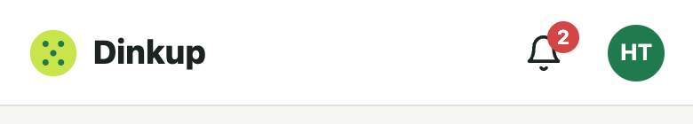
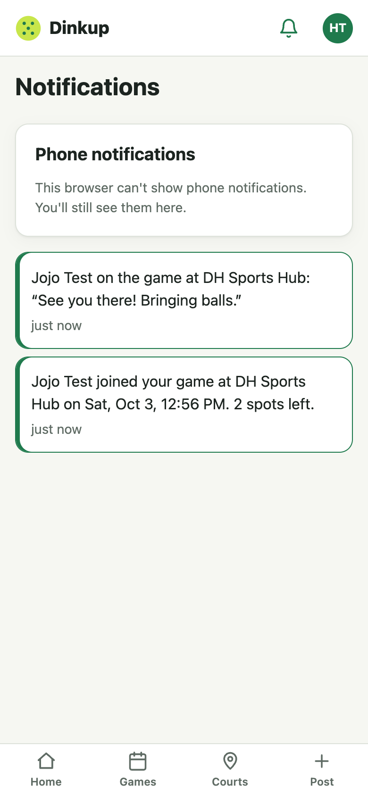

# Change 14: Notifications, in the app and on the phone

**Date:** 2026-10-02 (after launch)

## Prompt

> go with 4-8 improvements for now

Item 7. Until now, players only found out about things by opening Dinkup: someone joined, a result was waiting, a game was cancelled. The AI asked how notifications should reach players, and the developer picked the recommended **in-app inbox plus phone push**.

## What triggers a notification

| Event | Who gets it |
|---|---|
| Someone joins / leaves your game | The host ("…2 spots left." / "A spot is open again.") |
| A game is cancelled | Its players |
| A new comment | The game's other players, with the comment's first 80 characters |
| A win is reported against you | The losing side, with the deadline to confirm |
| A disputed result is corrected ([change 13](change-13-dispute-correction.md)) | The new losing side |
| Your win is confirmed / disputed | The winning side (with the correction deadline, if there is one) |

Never the person who did it, and never **demo players** (the fake cast and "Try the demo" visitors), so demo games stay silent.

## What was built

- **`notifications` table:** one row per recipient. The text is written when it happens, and tapping it opens the game. Read notifications are cleared after 30 days.
- **Inbox API:**
  - `GET /api/notifications` returns the newest 30 and the unread count.
  - `POST /api/notifications/read` marks them all read.
- **Bell in the header**, with a red unread badge. It refreshes when the app opens, when it comes back to the foreground, and every minute while visible.
- **`/notifications`:** opening it marks everything read, but this visit's new ones stay highlighted.
- **Phone push (Web Push, the `web-push` package):**
  - **Subscriptions:** `push_subscriptions` stores one row per browser install. `POST /api/push/subscribe` and `/unsubscribe` manage them, and `GET /api/push/key` returns the public key.
  - **Sending:** after the inbox rows are saved, the server pushes to each recipient's devices in the background. A slow push service never delays the action, and a failure never breaks it. Devices the push service reports gone (404/410) are deleted.
  - **Service worker:** `client/public/push-sw.js` is pulled into Workbox's generated service worker with `importScripts`. It shows the notification, and a tap opens the game, reusing an open Dinkup window if there is one.
  - **Notifications page:** a "Phone notifications" card shows the state for this device:
    - "Turn on notifications" when it's off. The browser only shows the permission prompt after a tap, never on open.
    - On iPhone outside the home-screen app, "add Dinkup to your home screen first", with a link to `/install`.
    - "Blocked in settings" when permission was denied.
    - "This phone gets Dinkup notifications" when it's on.
  - **Logging out** removes this phone's subscription, so a shared phone stops getting someone else's notifications. Opening notifications re-links an existing subscription to whoever is logged in now.
- **Keys:** VAPID keys come from the environment (`VAPID_PUBLIC_KEY`, `VAPID_PRIVATE_KEY`, both in `render.yaml` and `.env.example`). Without them, push is off and the inbox still works. Dev and production use different key pairs, and neither is committed.

## How it was checked

- **10 API tests:**
  - Each event reaches the right people, and never the actor.
  - Demo players get nothing.
  - The inbox is private, newest first, and marks read.
  - Push goes to the recipient's devices with the game link.
  - A 410 deletes the subscription.
  - A device moves to whoever subscribes on it last.
  - Logged-out and malformed subscribes are refused.
- **Tests never send real pushes.** `server/.env` now has dev keys, so the test config blanks them and the tests swap in a fake sender.
- **Browser, dev server:**
  - A player joins and comments. The host's bell shows "2 unread", the inbox lists both, opening it clears the bell, and tapping an item opens the game.
  - At 320 px in dark mode, nothing overflows.
- **Real push, on a local production build** (service workers only run there):
  - "Turn on notifications" subscribed Chrome through Google's push service (`fcm.googleapis.com`).
  - A synthetic push event made the service worker show a notification with the right link.
  - **End to end:** a second player joined the first player's game, the server pushed through Google, and Chrome displayed "Omar Other joined your game at Andot Pickle Court…".
- **Not checked:** tapping a notification, and push on a real iPhone or Android phone.

## What had to be fixed

- **Logout would have hung in development.** `navigator.serviceWorker.ready` never resolves when no service worker is registered (dev mode). Push helpers now use `getRegistration()`, which answers immediately.
- **The time ran into the notification text.** The `.notification` layout came earlier in the stylesheet than `.card-link`, so it was overridden. A more specific selector fixed it, confirmed by checking the computed style, because a screenshot with the same file name had shown a stale image.
- **Local production logins failed** in the push test. Production session cookies are HTTPS-only, and Render's proxy says "https". The test browser now sends `X-Forwarded-Proto: https` to imitate the proxy, with no app change.

## To turn on push in production

Add `VAPID_PUBLIC_KEY` and `VAPID_PRIVATE_KEY` in Render → Environment. Until then, the inbox works and the phone card stays hidden.
