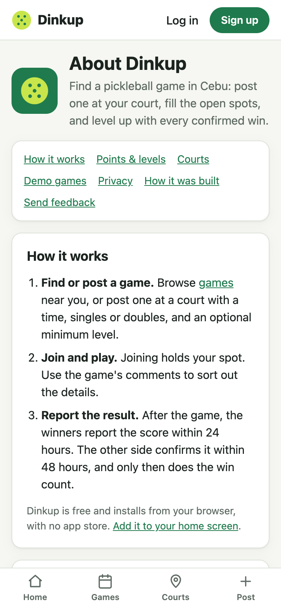

# Change 16: An About page, and feedback saved to the database

**Date:** 2026-10-02 (after launch)

## Prompts

> maybe lets add some about? or something explains about inside the app? what do you think? or only in the web?
> built it both but the feedback will be in save in DB only for now
> remove how it is built

The AI recommended putting it **inside the app**: Dinkup is a web app, so one `/about` page works in the installed app and the browser alike. The developer agreed, and asked for feedback to be stored in the database only (no email or inbox yet).

## What was built

**`/about`**, one scrolling page with a table of contents:

| Section | What it says |
|---|---|
| How it works | Find or post, join and play, report the result |
| Points & levels | 1 point per confirmed win, 5 to level up, the three cases where a win earns nothing, the level lock, and the one-correction rule after a dispute |
| Courts | Every pin is hand-checked; players can add missing courts |
| Demo games | What the "Demo" label means, so nobody travels to a court for a fake game |
| Privacy | Location (courts sorted on the phone; for games a rounded ~10 m position is sent and never saved), what other players see, notifications, map services |
| Send feedback | The form |

- **The rules can't drift.** Every number on the page (5 points, 2 wins in 30 days, 7 days and 3 results, the 24 h and 48 h windows, the levels) comes from the same shared constants the server enforces.
- **The privacy text was checked against the code**, not written from memory. Courts are sorted in the browser. Games send `near=` rounded to 4 decimals (about 11 m). The server has no request logging, so it really isn't saved.
- **No "How it was built" section.** The first version credited the developer and linked the repo and this build log. The developer asked to remove it, so the page is only about using Dinkup. The build story stays in the README and `docs/log/`.
- **Links to it:**
  - Home: About · How points work · Send feedback.
  - Profile: Notifications · About · Send feedback.
  - Every confirmed result card: "How points work", which jumps to `#leveling`.
  - Every court sheet: "Wrong pin or details? Tell us", which opens the form with that court and "A court is wrong or missing" filled in.

**Feedback** (`POST /api/feedback`, `feedback` table):
- **Kinds:** something broke, a court is wrong or missing, an idea, something else.
- **Message:** 5–1000 characters.
- **Saved with it:** guests can leave an optional email or phone for a reply; for a logged-in player, their account (they already have an email). Also the court, when sent from a court sheet, and the browser's user agent (useful for bug reports).
- **Anti-spam:** guests can post, so it's limited to 5 an hour per address. A hidden "website" field catches bots: when it's filled in, the server answers "saved" but stores nothing.
- No admin screen yet; it's read from the database.

## How it was checked

- **5 API tests:**
  - A guest's feedback is saved with its contact.
  - A player's is linked to their account and the court; an unknown court id is dropped.
  - Validation rejects bad input.
  - The bot trap stores nothing.
  - The 6th message in an hour gets 429.
- **Browser:**
  - Every rule number appears correctly, and all sections render.
  - An empty submit shows "Tell us a little more", and a guest submission shows "Thanks!". The saved row was read back from the dev database.
  - `#leveling` lands below the sticky header.
  - The court-sheet link opens the form with "About: DULA Pickleball Courts Cebu".
  - At 320 px in dark mode there's no horizontal scroll and no console errors.

## What had to be fixed

- **Feedback "failed" in the browser test.** It wasn't the app: an **old Vite dev server** from an earlier session still held port 5173 and proxied to a dead API (502), so the new one had moved to 5174. All dev processes were stopped and restarted on the right ports.
- **The rate limit tripped across tests.** Every test request comes from the same address. Resetting the limiter by the raw IP did nothing, because `express-rate-limit` now keys IPv6 addresses by subnet. The test builds the key with the library's own `ipKeyGenerator`.
- **The hidden bot field still took 8×6 px** because of global input padding. It's now 1×1 and clipped.
- **The table of contents stacked one link per line.** The page's general `.stack > .card` rule made every card a column; a more specific rule lays the links out in rows.
