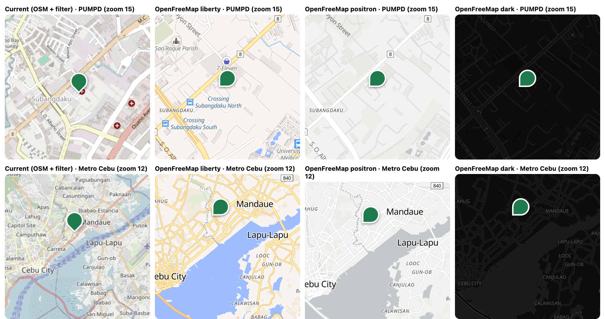
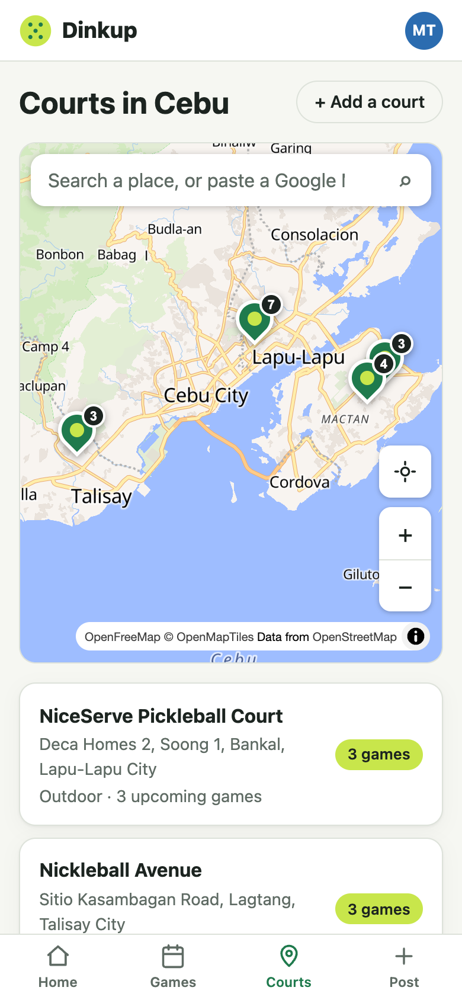
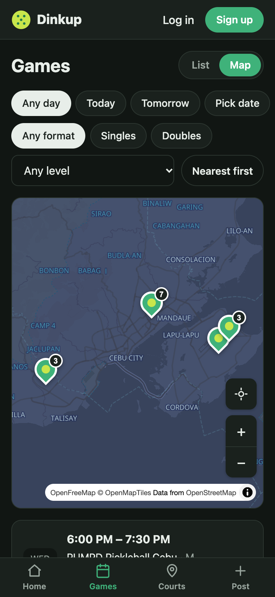
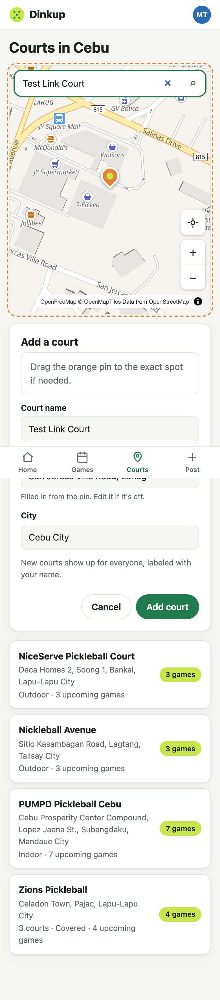
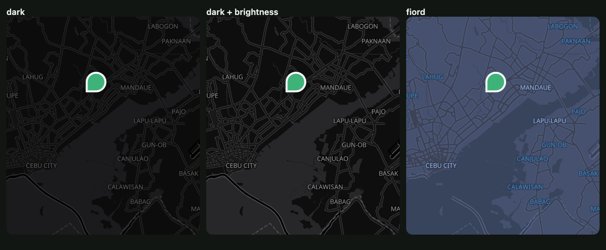

# Change 2: MapLibre + OpenFreeMap, search as you type, paste a Google Maps link

**Date:** 2026-09-30 (after launch)

## Prompts

> how you handle search location? only db? can you use the google maps? …
> is there any free but still like google maps
> what pickleheads use? is it free?
> maybe the google places API?
> what if openFreeMap? / or use the mapLibre? because it use the openFreeMap? what do you think
> yes please, dont forget about the docs after

## The decision

The developer wanted Google-quality maps and search. The options, researched before building:

| Option | Look | Venue search | Cost / account | Blocker |
|---|---|---|---|---|
| **Google Places + Google Maps** | Google | Best coverage | Billing account; free monthly caps, then about $5–17 per 1,000 lookups | **Places data may only be shown on a Google map**, and its coordinates can be kept only **30 days** (only the place ID forever). So it means replacing our whole map and re-fetching coordinates monthly. |
| CARTO basemaps (tried in change 1) | Clean | none | Now needs an API key | Every tile was an "API KEY REQUIRED" placeholder |
| **MapLibre + OpenFreeMap** ✅ | Close to Google (Liberty) | none (map only) | Free: no key, no limits | none |
| **Photon** search ✅ | none | OpenStreetMap data, built for as-you-type | Free public instance (fair use) | Knows fewer venues than Google |
| **Paste a Google Maps link / coordinates** ✅ | none | Anything on Google Maps | Free, no API | Share links aren't an official format |

The chosen combination gives a Google-like map and Google's venue coverage (via links players paste), with no billing, no terms risk, and coordinates we're allowed to keep. What Pickleheads uses couldn't be verified (their site blocks automated requests), and it doesn't matter much: their advantage is a large, player-maintained court database, which is the approach Dinkup's "add a court" feature takes.

## What was built

- **Map engine: Leaflet → MapLibre GL 6**, with **OpenFreeMap** styles: **Liberty** in light mode and **Fiord** in dark mode.
  - The same component API (`CourtMap`), so the Courts, Games, and Post a game pages didn't change.
  - Pins are HTML buttons (keyboard-focusable) with the game-count badge. The orange draft pin is draggable.
  - Our own locate and zoom buttons, sized for phones.
  - No scroll-wheel zoom trap, no rotation or tilt.
  - If the device has no WebGL, a plain message appears instead of the map; the list still works.
- **Search as you type** with **Photon** through our server: debounced 350 ms, arrow keys plus Enter, and a proper combobox for screen readers.
  - Results are limited to Cebu by a bounding box, *and* by Photon's `state` field, because the rectangle also covers parts of Bohol and Negros. Duplicates are merged (Photon returns a mall three times: the land, the building, the shop).
  - The server spaces Photon calls 200 ms apart, caches for 24 h, and applies a per-IP limit of 60 a minute.
- **Paste instead of search:**
  - **Coordinates** (`10.3242, 123.9268`) show a "Go to these coordinates" suggestion.
  - **A Google Maps link** shows "Use the location from this Google Maps link", which reads the place pin (`!3d…!4d…`), `?q=lat,lng`, or, as an *approximate* fallback, the view center (`@lat,lng`), plus the place name for the court name.
  - **Short links** (`maps.app.goo.gl/…`) are resolved on the server, one manual redirect at a time, **only while every hop stays on Google Maps domains** (SSRF guard). A test proves a short link that redirects to `169.254.169.254` (the cloud metadata address) is refused before that address is ever requested.
- The address for a dropped pin still comes from **Nominatim** (1 request per second, no autocomplete, per its policy), which gave the best street and barangay names.
- 8 more tests (107 total).

## What had to be fixed

- **MapLibre's worker didn't load, so there were no tiles at all.** MapLibre parses tiles in a Web Worker that it loads from a file next to its own code. Vite's dev pre-bundling moves that file, and the **production build didn't include it at all**, so the live map would have been blank. The browser test caught it ("Worker failed to load", 0 tiles). The fix bundles the worker ourselves (`?worker&url`, `worker.format: 'es'`) and calls `setWorkerUrl`.
- **A wrong size estimate.** The AI first told the developer MapLibre was about 150 KB gzipped (the CDN's main file). The real bundle is about **281 KB**, because it includes the worker. It was corrected in the chat.
- **The offline cache would have tripled.** The service worker pre-downloaded everything, so every install would fetch the map engine (1.6 MB upfront) even for people who never open a map, a real cost on Philippine mobile data. The map chunk and worker are now left out of the upfront download and cached the first time a map opens. Upfront is **494 KB**, less than before.
- **Map buttons drew over the bottom sheet.** Their z-index escaped the map. `isolation: isolate` on the map wrapper contains it; checked with `elementFromPoint` (the sheet is on top).
- **Zoom buttons overlapped MapLibre's attribution strip.** They were moved up.
- **Dark mode: OpenFreeMap's "Dark" style made land and sea both near-black**, which hides the coastline on an island map. Dark, a brightened Dark, and **Fiord** were compared side by side, and Fiord was picked.
  
- **The selected pin was hidden behind the sheet on the Games page**, where the map sits below the filters. The map now scrolls itself to the top when a sheet opens. The first version only handled "map below the viewport"; the checker caught the scrolled-down list case (map *above* the viewport), and the condition became "not already at the top". Checked on both pages at 390 and 320 px.
- **A local preview rendered blank.** The side-by-side comparison page first ran from `file://`, and the tile server refuses that origin. It was served over `http://localhost` instead. (Not an app bug, but it would have been easy to conclude "OpenFreeMap doesn't work".)

## Follow-ups

- The map needs a connection (tiles aren't cached offline).
- If traffic grows, host Photon ourselves (it's open source) instead of using the public instance.
