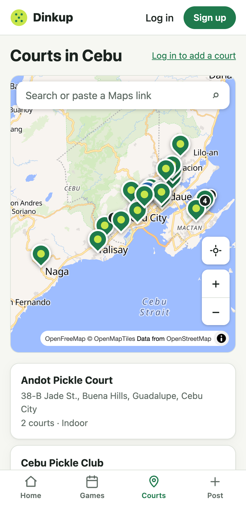
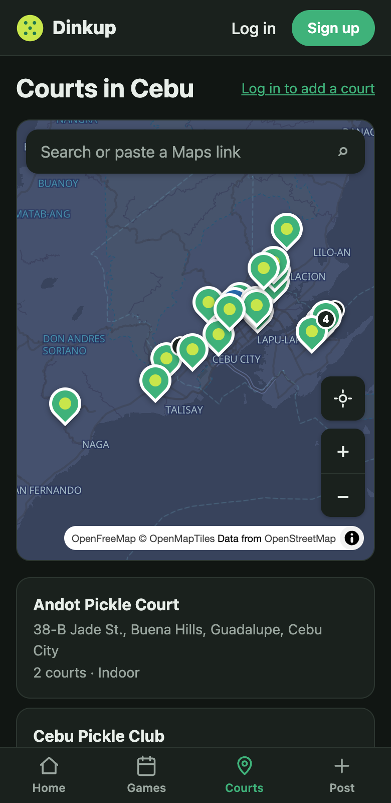

# Change 3: Pin the remaining Cebu courts (4 → 21)

**Date:** 2026-10-01 (after launch)

## Prompt

> please continue

The AI offered four open items and recommended this one. The developer picked "Pin the 18 courts".

## Why it mattered

At launch the map had only 4 curated courts. Another 18 real venues were listed in `server/prisma/data/courts.ts` with `lat: null`, because the rule for that file is **never guess a pin**: a wrong pin sends players to the wrong place. OpenStreetMap has almost no pickleball data for Cebu. A fresh Overpass query found only the 4 courts already pinned, plus 3 unnamed pitches that turned out not to match any listed venue.

## How the pins were found

Three research agents worked in parallel, one per area: Cebu City, Mandaue, and Talisay / Lapu-Lapu / Naga / Consolacion. All three had the same evidence bar:

- **Verified** means the coordinates come from a source tied to that venue: the venue's own website, or the Google Maps place that a directory embeds or links for that venue, matched by its place ID. Geocoding a street or barangay name doesn't count.
- Each pin is **reverse-geocoded with Nominatim** and must land on the street or barangay in the venue's address.
- When sources disagree on court counts, the count is left blank instead of picking one.

The main AI then re-checked every result itself before using it. It reverse-geocoded all 17 pins and opened sample sources (DULA's and Kahoy's directory embeds, Velocity's website) to confirm the place IDs and coordinates were really there.

These are the coordinates of physical places, copied the same way the data file already told maintainers to ("right-click the pin, copy the coordinates"). No Google API is called and nothing is fetched at runtime, so the Places terms that ruled out Google search in [change 2](change-2-maplibre.md) don't apply.

## Result

| | Venues |
|---|---|
| **Pinned (17 new)** | Velocity, Andot, HQ, DH Sports Hub, Prime Rally, Net and Paddle (Cebu City); DULA, Royall, Rocket Pickle, Pickaball, Power Play, VYBE, Side-out (Mandaue); Kahoy (Consolacion); PickleBear (Lapu-Lapu); Pickle Vybes (Talisay); Cebu Pickle Club (Naga) |
| **Left unpinned (1)** | Pino Pickleball Court. Directories pin it on San Jose Road, but Google now calls that place "ML Lifestyle Park - Sports & Food Park". It needs a local check before it goes on the map. |

The map now shows 21 curated courts.

## What had to be fixed

- **Bad data in the old list:**
  - **Net and Paddle** was listed under Talisay City, but its own Facebook page, Google, and OSM all put it in Sawang Calero, **Cebu City**.
  - **Kahoy Pickleball** is not the OSM node "Kahoy Cafe". It's a separate place about 80 m east.
- **One directory's pins are unreliable.** cebucourtsandclubs.com put Pickaball Sports Center about **4 km** away, in Talamban, Cebu City, and two other venues 600–700 m off. None of its coordinates were used. Directory map *centers* were also ignored: for Side-out, the center was 7 km from the venue's actual place pin.
- **Seeding could create duplicate pins.** When the dev database was seeded, "HQ Pickleball Cebu" appeared twice, because a test player had already added it from the app. The production database had no player-added courts, so the live site was never affected. But once real players start adding courts, every future seed could hit the same problem. The seed now applies the same 50 m rule as the "add a court" API: if a player's court is already at that spot, the curated copy is skipped and logged (`Skipped HQ Pickleball Cebu (player-added "HQ Pickleball Cebu" is already there)`). The player's court is kept because games may point at it. Courts that were already seeded still update normally.
- **A slip in delegation.** The first research agent was launched with a placeholder instead of its instructions. It was stopped right away and relaunched with the full brief.

## Follow-ups

- Confirm Pino / ML Lifestyle Park on the ground, then pin it.
- Pins in Cebu City and Mandaue overlap at the default zoom (Royall and Rocket Pickle are 120 m apart). Clustering pins would help as the map fills up.
- Court counts come from directories, not the venues. Let players suggest corrections.
