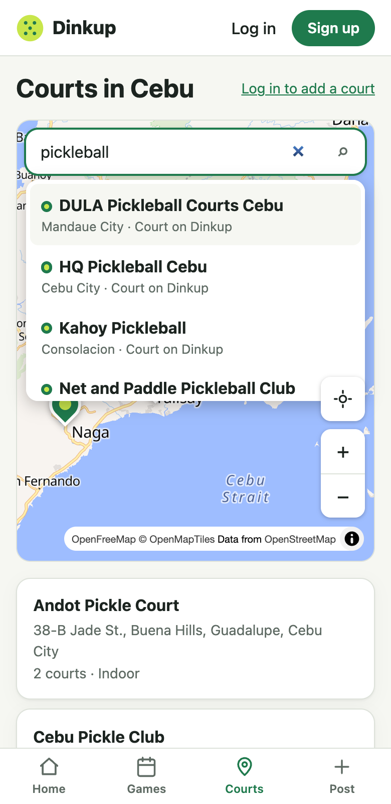

# Change 4: Search finds Dinkup's own courts

**Date:** 2026-10-01 (after launch)

## Prompts

> i will try using the google maps because it can search all, what api should i search in google console?
> why our current maps search doesnt have a autocomplete address just like google maps?
> yes do step 1

## The finding

Search as you type already existed (change 2). The real gap was the **data** behind it. Photon only knows OpenStreetMap, and in Cebu OSM has the big landmarks and streets but few small businesses and almost no house numbers. The AI ran sample searches on the live site to show this:

| Typed | Result |
|---|---|
| `sm seaside`, `it park`, `ayala center` | The right places |
| `gorordo`, `zuellig`, `jade st` | The streets |
| `38 jade st guadalupe` | The street only (no house numbers) |
| `dula pickleball` | **Nothing** |
| `pickleball` | 2 venues, though Dinkup has 21 |

The last two rows were a gap in Dinkup itself: the search never looked at our own courts. The AI gave three options: (1) search our own courts first, which is free; (2) add Google Places Autocomplete, which needs billing and comes with Google's 30-day coordinate rule and Google-map-only rule; (3) paste a Google Maps link, which already works. The developer chose 1.

## What was built

- **Our courts appear first, from 2 characters, with no network wait.** The courts are already loaded for the map, so matching happens in the browser. Photon results follow after the usual 350 ms.
- **Matching** (`matchCourts` in `shared/src/courts.ts`):
  - Every typed word has to start a word in the name, address, or city. So `dula`, `pickle mandaue`, and `gorordo` all match, but `ckle` doesn't.
  - Names typed without spaces or punctuation still match: `sideout` finds Side-out.
  - Accents are ignored.
  - A name that starts with what you typed ranks first, then other name matches, then address or city matches.
- **No double entries:** a Photon result within 50 m of a Dinkup court shows as the court, not as a second "place".
- **Choosing a court works like tapping its pin:**
  - On Courts, it opens the court's sheet.
  - On Post a game, it selects that court in the form.
  - While adding a court, it moves the draft pin there, so "Is it one of these?" appears.
- Court results have a mini map pin and show "N upcoming games" or "Court on Dinkup".
- 7 unit tests for the matching.

## What had to be fixed

- **The first version matched the middle of words.** The no-spaces rule (for `sideout`) used a plain substring check, so `ckle` matched every "Pickleball". The test caught it. The rule now only matches from the start of a word.
- **The map buttons covered the results list** at 320 px (the locate button drew over the last result). The search box now sits above the other map controls. Checked with `elementFromPoint`.
- **The test script first reported 0 results for every query.** The bug was in the script, which read `results` instead of the API's `places` field. The search itself was fine. It was caught before any wrong conclusion reached the developer.
