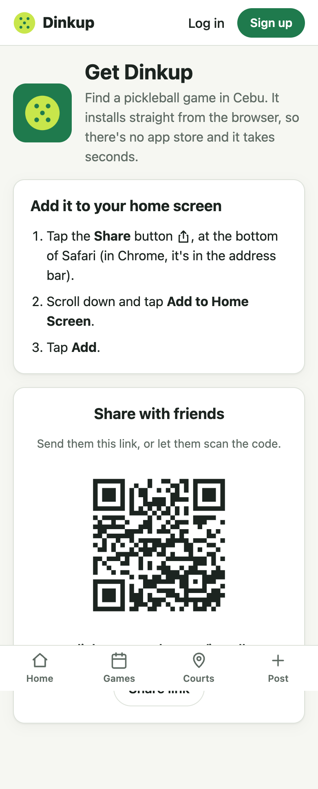
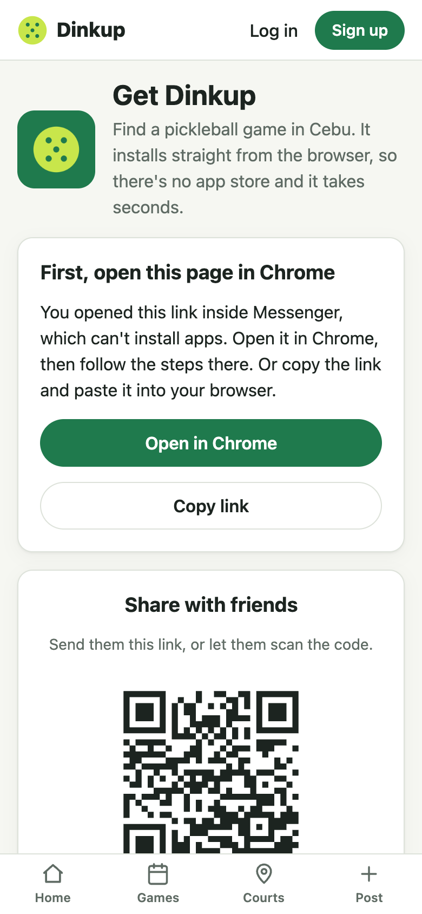

# Change 5: A link to share that installs Dinkup

**Date:** 2026-10-01 (after launch)

## Prompt

> also can create a link that i can share to other to install this?

## What was built

**https://dinkup.onrender.com/install** is a page that works out which phone and browser the visitor has, and shows the one way to install that works there:

| Visitor | What they see |
|---|---|
| Android Chrome, desktop Chrome or Edge (install prompt available) | One **Install Dinkup** button |
| iPhone / iPad | **Share** → **Add to Home Screen** → **Add**, as 3 numbered steps |
| Android without the prompt (Samsung Internet, Firefox) | Menu ⋮ → **Install app** / **Add to Home screen** |
| **Inside Messenger, Facebook, Instagram, LINE, or TikTok** | "First, open this page in Chrome/Safari", with an **Open in Chrome** button on Android (an `intent://` link) and Copy link |
| A computer without the prompt | "Best on your phone", with the QR code |
| Already installed | "You're all set" |

The in-app browser case matters most here. In the Philippines, links are mostly shared over Messenger, and Messenger's built-in browser can't install apps. Without that warning, most invitees would see install steps that don't work.

The page also has:
- **A QR code** (`client/public/install-qr.svg`, made once with the `qrcode` package, so the app doesn't load a QR library). It stays dark-on-white in dark mode so cameras can read it. A test decoded it back to the exact URL.
- **Share link**, which opens the phone's share sheet, or **Copy link** where that's not available.
- An **"Invite your group"** card on the home page that links here.
- **Link-preview tags** (Open Graph) in `index.html`, so a pasted link shows the Dinkup name, a description, and the icon in Messenger and Facebook instead of a bare URL.

## How it was checked

Playwright loaded the page with real user-agent strings for iPhone Safari, Android Chrome, Messenger on Android, Facebook on iPhone, and desktop Chrome. Each one got the right instructions. Also checked at 320 px in dark mode (no horizontal scroll).

**Not checked on a real phone:** the actual install prompt and the Messenger → Chrome `intent://` handoff. Those can only be tested on a device.

## What had to be fixed

- **The copy-link button's text overflowed** its button at 390 px ("Or copy the link and paste it in your browser"). The explanation moved into the paragraph, and the button now just says **Copy link**.
- `isIosSafari()` (used by the home page's install banner) now returns false inside Facebook's in-app browser on iPhone. Its user agent can look like Safari, but "Add to Home Screen" isn't available there.

## Follow-ups

- A proper 1200×630 link-preview image. The square icon shows as a small thumbnail.
