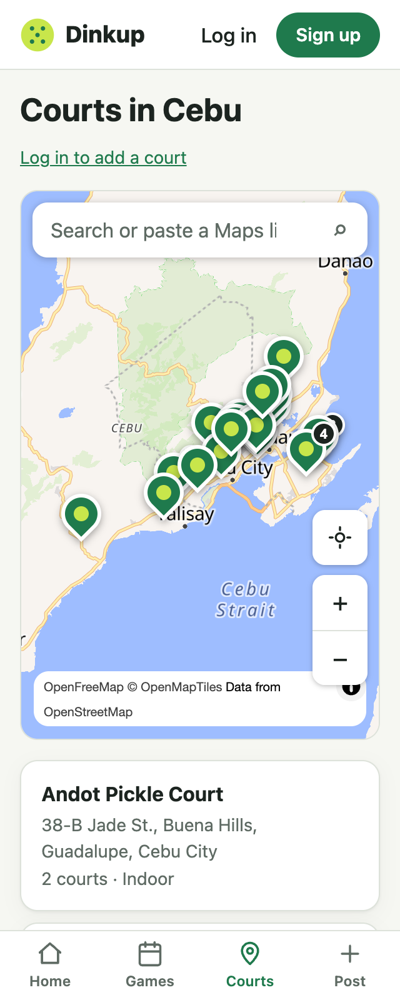
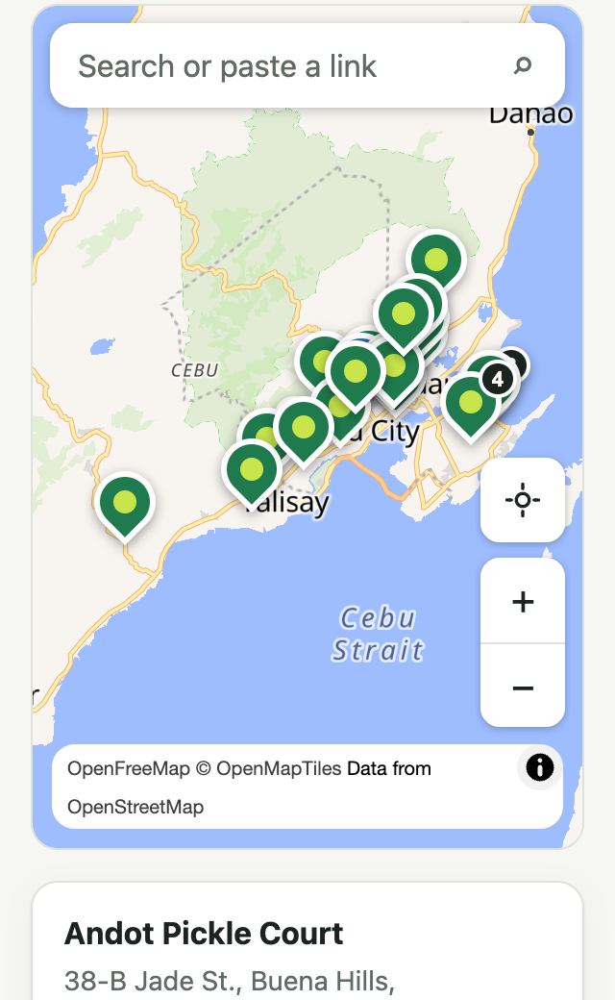

# Change 6: Map controls on 320 px phones

**Date:** 2026-10-01 (after launch)

## Prompt

> continue the next step then create a seperate branch or PR dont directly push to main

The next step was the small-screen issue the AI found while checking change 3 on the live site. From here on, work goes to a branch and a pull request instead of straight to `main`. Merging is what deploys to Render.

## The problems (both from before this change, visible only at 320 px)

1. **The zoom-out button covered the map credits.** At 320 px, "OpenFreeMap © OpenMapTiles Data from OpenStreetMap" wraps to two lines, but the zoom buttons sat at a fixed 44 px from the bottom, sized for one line.
2. **The search placeholder was cut off** ("Search or paste a Maps li…").

## The fix

- **The buttons follow the credits.** `CourtMap` watches the credit box's height with a `ResizeObserver` and stores it in a CSS variable, `--attrib-h`. The zoom and locate buttons are placed relative to that variable. So they sit above the credits whether it's two lines (320 px), one line, or collapsed to the ⓘ button after the map is dragged. The credits themselves stay fully visible, as the OpenStreetMap attribution rules expect.
- **A shorter placeholder on narrow screens:** "Search or paste a link" at 360 px and below, and "Search or paste a Maps link" everywhere else. The font size couldn't shrink instead, because iOS zooms the page when a field under 16 px gets focus.

## How it was checked

Playwright measured the actual boxes instead of only taking screenshots:

| Width | Credits height | Gap above credits | Overlap | Placeholder fits |
|---|---|---|---|---|
| 320, light and dark | 44 px (2 lines) | 9 px | none | yes (156 of 195 px) |
| 320, after dragging the map | 24 px (collapsed) | 9 px | none | yes |
| 390 | 24 px | 9 px | none | yes (200 of 265 px) |
| 1200 | 24 px | 9 px | none | yes |

The full placeholder measures 200 px, and at 320 px the field only has 195 px. That confirms why it was being cut off.
