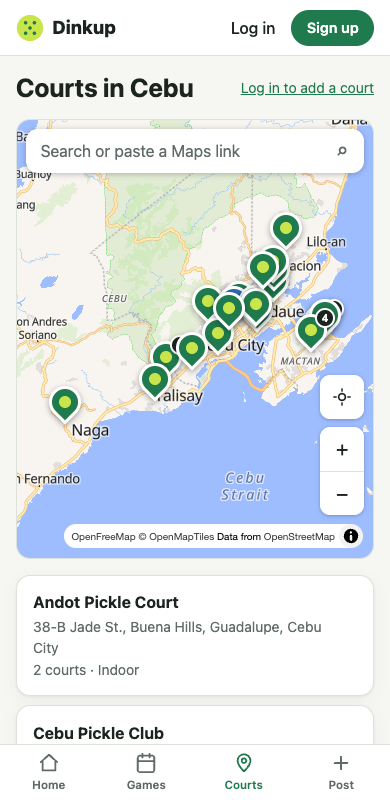

# Change 7: Installed apps broke on "Find a court" after a deploy

**Date:** 2026-10-01 (after launch)

## Prompt

> it went wrong in app upon click on find courts

## What happened

A fresh visit to the live site worked (21 pins, no errors), so the AI suspected the **installed app** running an older version. It reproduced the problem locally with a production build and a real service worker:

1. Install version A, without ever opening a map.
2. "Deploy" version B, where the map code changed, so its file has a new hash.
3. Open the installed app and tap **Find a court**. The result is **"Something went wrong"**.

Three problems combined:

- **The old version keeps running until the player opts in.** The service worker is set to *prompt* (step 8: never swap versions mid-form), so the old version stays until the player taps **Reload** on the update toast or closes every window.
- **The map code isn't stored up front.** It's left out of the install download on purpose (change 2, to save mobile data). So the old version asked the server for its own map file, `CourtMap-<old hash>.js`, which the deploy had deleted.
- **The server answered that missing file with `index.html` and status 200.** The single-page-app fallback caught every unknown path, so the browser tried to run HTML as JavaScript. The service worker's cache-first rule also **stored that HTML under the script's name**. The AI found this by opening the cache: `CourtMap-DAxUS89K.js -> text/html`.

The error page's **Reload** didn't help either: it reloaded into the same old version.

## The fix

- **Server:** a missing file under `/assets` now gets a plain **404**, never `index.html`.
- **Service worker:** the map cache only keeps responses that are actually JavaScript or CSS.
- **App:** when a page fails because a code file didn't load (Chrome, Safari, and Firefox each word this error differently), the app shows **"Updating Dinkup…"**, activates the waiting new version (`SKIP_WAITING`), and reloads. If no new version is waiting yet, it checks for one first. It won't try again within 30 seconds, so a broken release can't loop. The error page's **Reload** button does the same, so it now actually picks up the new version.

## How it was checked

The same local test was run with fixed versions A′ and B′. Tapping **Find a court** in the old installed version got a 404 for its missing map file, updated itself, and opened Courts with **21 pins**. The map cache held only real JS and CSS. The Games page's map view (which loads the same map code) was tested the same way and recovered too, with 4 pins.

The developer also saw the error screen from **Upcoming games**. On the live site every path from there worked: all 3 game pages, See all, and the Games map, both as a guest and logged in. That points to the same old-version problem, through the Games map.

## Note for players stuck on an old version

The automatic recovery only works in versions that include it. Anyone stuck before this deploy should tap **Reload** on the "A new version of Dinkup is ready" toast, or fully close the app (swipe it away) and open it again.
