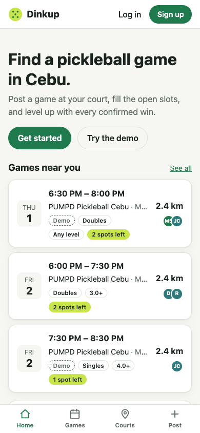
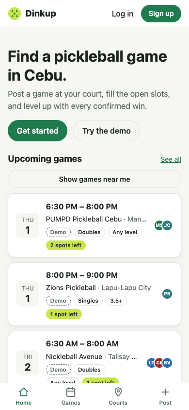

# Change 8: Games near you, without a prompt on open

**Date:** 2026-10-01 (after launch)

## Prompt

> also the upcoming games went wrong, it should also require the location when user open the app i guess

The AI asked two questions. First, what went wrong? The developer answered "error screen". That turned out to be the old-version problem fixed in [change 7](change-7-stale-app.md): on the live site, every Upcoming games path worked for both guests and logged-in players. Second, how should location work? The developer picked the recommended option: use location automatically if it's already allowed, and otherwise offer it with one tap. A prompt as the app opens was rejected because players usually deny prompts with no context, and on an iPhone home-screen app a denial is hard to undo.

## What was built

- **Home shows "Games near you"** (nearest first, with distances) when location is available. Otherwise it shows the soonest "Upcoming games" with a **Show games near me** button.
- **No prompt on open.** The browser's location prompt still only appears when the player taps a button. If the player has already allowed location (checked with the Permissions API, which never prompts), the app uses it right away.
- **One location for the whole app.** Found once, Home, Courts, and Games all sort by distance without asking again.
- **No flicker.** Home waits the moment it takes to check permission before loading games. Otherwise the list would appear sorted by time and then reorder by distance. An automatic lookup gives up after 3 seconds, so Home never waits long.

## How it was checked

Playwright ran Home with location **allowed**, **not asked yet**, and **denied**. It counted every call to `getCurrentPosition` and every request to `/api/games`:

| State | Heading | Location requests | Games request |
|---|---|---|---|
| Allowed | Games near you, with distances | automatic, no prompt | one: `?limit=3&near=…` |
| Not asked | Upcoming games + button | **0** until the tap | `?limit=3`, then nearest after the tap |
| Denied (after the tap) | Upcoming games | 1 (the tap) | "Location permission was denied." shown |

With location allowed, opening Courts afterwards listed DH Sports Hub (0.6 km) first without any tap.

## What had to be fixed

- **The button didn't fit in the header at 320 px.** "Show games near me" next to "See all" made the page scroll sideways. It moved to its own row under the heading.
