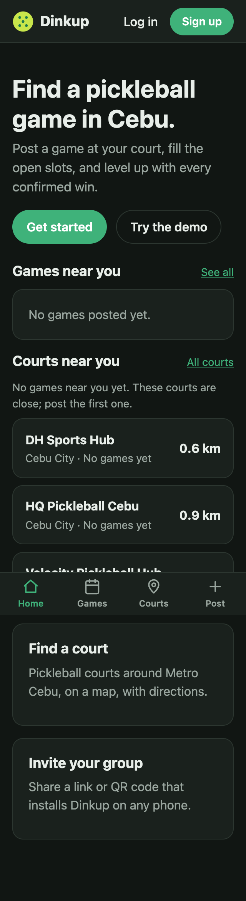
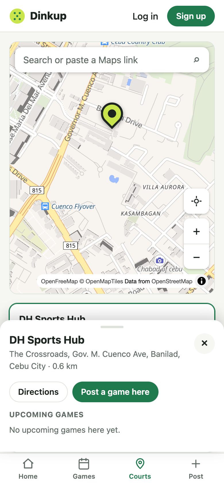

# Change 9: Courts near you on Home

**Date:** 2026-10-01 (after launch)

## Prompts

> what if user wants to know nearby courts, not just scheduled
> yes build it

The Courts tab already sorted courts by distance. The gap was Home: it only showed *scheduled games*, so a player near a court where nobody had posted yet saw nothing useful. The AI recommended a "Courts near you" section, and the developer said to build it.

## What was built

- **"Courts near you" on Home**, under the games, once location is known. It lists the 3 nearest courts with their distance, plus "N upcoming games" or "No games yet".
- **When no games are near**, the section adds: "No games near you yet. These courts are close; post the first one." Nearby courts become the fallback instead of an empty screen.
- **Tapping a court opens it on the Courts tab** with its sheet open (Directions, Post a game here, upcoming games). This works because `/courts?court=<id>` is now a real link: the Courts page opens that court, and the URL follows the selection, so any court can be shared or bookmarked. Closing the sheet clears it.
- The button is now **"Show games and courts near me"**, because one tap fills both sections. As in [change 8](change-8-games-near-you.md), there's no location prompt on open; location is used automatically only if it's already allowed.

## How it was checked

Playwright, with the location set to Cebu IT Park:

| Case | Result |
|---|---|
| Location allowed | DH Sports Hub 0.6 km, HQ Pickleball 0.9 km, Velocity 1.6 km |
| Tap DH Sports Hub | `/courts?court=…` with the DH Sports Hub sheet open; closing it returns to `/courts` |
| Fresh visit to `/courts?court=<Kahoy>` | Kahoy Pickleball sheet open |
| Not asked yet | No courts section; after tapping the button, both sections appear |
| Denied | No courts section, "Location permission was denied." |
| No games anywhere (empty `/api/games` faked), 320 px dark | The fallback hint shows, no horizontal scroll |

No console errors in any case.
