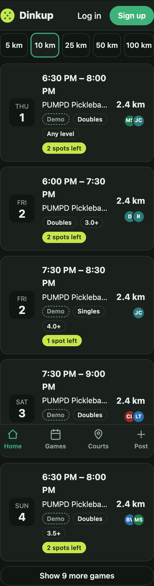
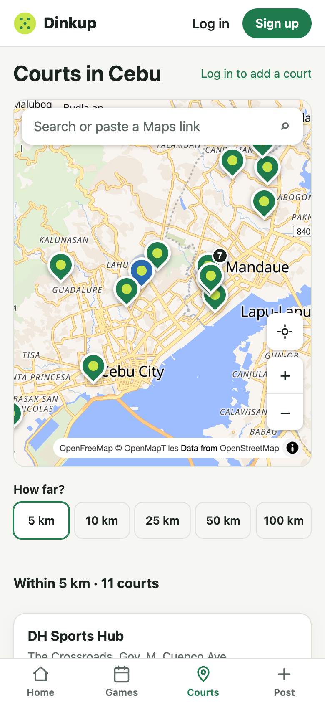

# Change 9: Courts near you on Home, within a distance you pick

**Date:** 2026-10-01 (after launch)

## Prompts

> what if user wants to know nearby courts, not just scheduled
> yes build it
> does it also check the near location that not in the game or schedule list?
> can you base on km near of the user
> like what ever near inside like 100km
> please also nearby me in the courts page or the maps will point as well even not in the games or scheduled

The Courts tab already sorted courts by distance. The gap was Home: it only showed *scheduled games*, so a player near a court where nobody had posted yet saw nothing useful. The AI recommended a "Courts near you" section, and the developer said to build it.

## What was built

- **"Courts near you" on Home**, under the games, once location is known. Each court shows its distance plus "N upcoming games" or "No games yet". At first this was the 3 nearest; it became "everything within a distance", described below.
- **When no games are near**, the section adds: "No games near you yet. These courts are close; post the first one." Nearby courts become the fallback instead of an empty screen.
- **Tapping a court opens it on the Courts tab** with its sheet open (Directions, Post a game here, upcoming games). This works because `/courts?court=<id>` is now a real link: the Courts page opens that court, and the URL follows the selection, so any court can be shared or bookmarked. Closing the sheet clears it.
- The button is now **"Show games and courts near me"**, because one tap fills both sections. As in [change 8](change-8-games-near-you.md), there's no location prompt on open; location is used automatically only if it's already allowed.

## Then: everything within a distance

The first version showed the 3 closest courts. The developer asked for a distance instead: "like what ever near inside like 100km". So:

- **A "How far?" picker on Home: 5 · 10 · 25 · 50 · 100 km**, defaulting to 10 km and remembered on the device. 100 km covers Cebu island.
- **Both sections list everything in range**, nearest first: "Games within 10 km" and "Courts within 10 km". Each shows the first 5, then **Show N more**.
- **The games API got a `within` filter** (`/api/games?near=lat,lng&within=10`). It runs on the server, so the cap of 50 games applies to games in range, not to the nearest 50 anywhere. `within` without `near`, or over 100 km, is rejected. 2 new tests.
- **Nothing in range:** the courts section becomes "Closest courts", with "No courts within 10 km. These are the closest." Someone in the far north still sees where to go.

## And on the Courts page and its map

- **The same "How far?" picker**, sharing one value with Home (`useNearRadius`): pick 25 km on Courts, and Home says "Games within 25 km".
- **The list is split** into "Within 5 km · 11 courts" and "Farther away". Every court stays listed with its distance, games or not.
- **The map frames you plus every court in range** (or the closest 3 if none are), and re-fits smoothly when the distance changes. It doesn't re-fit on other re-renders, and it doesn't override a court opened from a link.
- Before location is allowed, Courts has its own **Show courts near me** button. As everywhere else, there's no prompt on open.

## How it was checked

Playwright, with the location set to Cebu IT Park:

| Case | Result |
|---|---|
| Location allowed | DH Sports Hub 0.6 km, HQ Pickleball 0.9 km, Velocity 1.6 km |
| Tap DH Sports Hub | `/courts?court=…` with the DH Sports Hub sheet open; closing it returns to `/courts` |
| Fresh visit to `/courts?court=<Kahoy>` | Kahoy Pickleball sheet open |
| Not asked yet | No courts section; after tapping the button, both sections appear |
| Denied | No courts section, "Location permission was denied." |
| No games anywhere (empty `/api/games` faked), 320 px dark | The fallback hint shows, no horizontal scroll |

Distance picker, from IT Park:

| Distance | Games in range | Courts in range |
|---|---|---|
| 5 km | 7 | 11 |
| 10 km | 14 | 17 |
| 25 km | 18 | all 21 (the farthest, Naga, is 22 km away) |
| 100 km | 18 | 21 |

Courts page, from IT Park. The check was that **every in-range court's pin is inside the visible map**:

| Distance | List | In-range pins missing from the map view |
|---|---|---|
| 10 km | Within 10 km · 17 courts / Farther away | none |
| 5 km | Within 5 km · 11 courts / Farther away | none |
| 25 km | Within 25 km · 21 courts | none |

A link to Kahoy still opened Kahoy, with its pin in view. Before location was allowed, there were no groups and all 21 pins showed; after tapping, it was "Within 10 km · 17 courts".

From Bogo City (about 90 km north), 10 km shows "Closest courts" with the note, and 100 km shows everything. The chosen distance survived a reload. At 320 px all 5 buttons fit, with nothing clipped and no horizontal scroll.

No console errors in any case.
