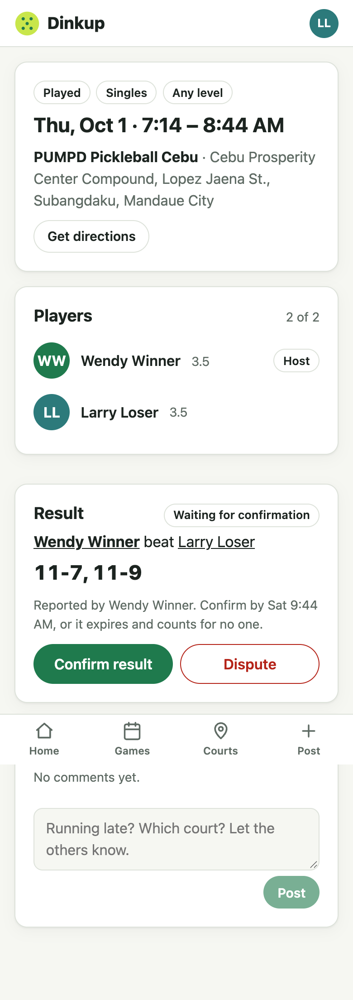
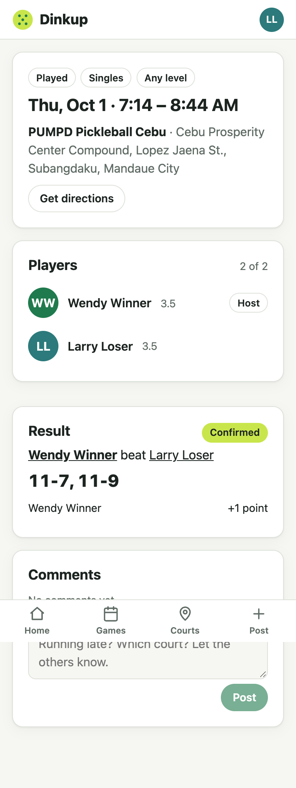
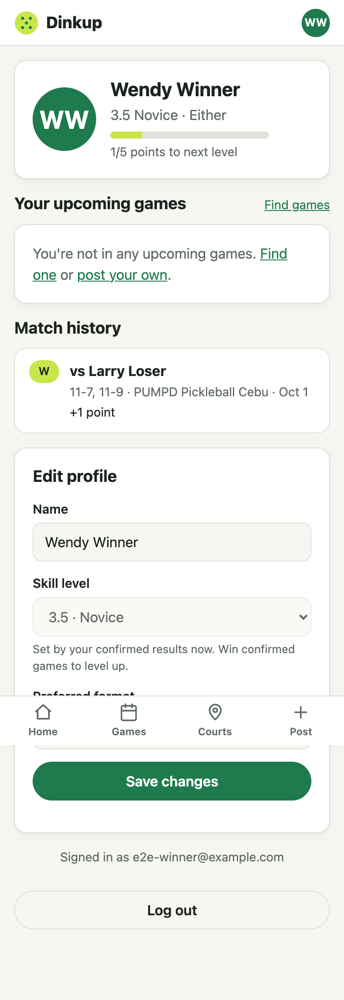

# Step 10 — Results and leveling

**Date:** 2026-10-01

## Prompt

> yes

## What was built

- **`match_results`** (one per game: unique `game_id`) and **`match_result_players`** (side, plus for winners: `points`, `points_note`, `leveled_up_to`).
- **Hand-written CHECK constraints:** points are 0 or 1 and only for winners, and `skill_points` can't go negative.
- **`POST /api/games/:id/result`**: a winner reports, within 24 h of the game ending, naming exactly the game's players (1v1 or 2v2), with a validated score (each game to 11+, won by 2, and the winners won more games).
- **`POST /api/results/:id/confirm`**: a loser confirms. Every guard runs, points are awarded, and players level up, all in one transaction.
- **`POST /api/results/:id/dispute`**: a loser disputes. The result is closed and earns nothing.
- **`GET /api/results/pending`** (results waiting for me) and **`GET /api/users/:id/results`** (public history, confirmed results only).
- **Lazy expiry:** pending results older than 48 h become `expired` whenever results are read or acted on. No cron job.
- **Leveling:** +1 point per qualifying win. At 5 points a player moves up a level and resets to 0. At 5.0 the bar stays full.
- **The self-set level locks** after a player's first confirmed result (the follow-up from step 1).
- **UI:**
  - **Game page:** "We won: report the result" (singles: you vs them; doubles: pick your partner), score rows, a result card with status, score, each winner's points *and the reason*, and Confirm / Dispute for the losing side with the deadline.
  - **Home:** a reminder when a result is waiting for you.
  - **Profile:** "Results to confirm", match history, and the locked level field with an explanation.
  - **Player pages:** match history.
- 18 new tests (125 total).

## Decisions worth explaining

- **Every 0 explains itself** (`points_note`): "opponents are a lower level", "already beat this opponent 2 times in 30 days", or "opponent account is too new or unproven". The anti-abuse rules become visible instead of feeling like bugs.
- **Doubles rules, made precise:**
  - The losing level is the *average* of the two losers' levels, and each winner is compared individually.
  - The same-opponent cap blocks the point if the winner has hit the cap against **either** loser. That's stricter than "both", so a fixed partner can't be used to farm a third player.
- **The confirm transaction**, in order:
  1. Lock the result row.
  2. Re-check that it's pending and hasn't expired.
  3. Check the confirmer is a loser and not the reporter.
  4. **Lock the winners' rows in id order.** A fixed order means no deadlocks between transactions.
  5. Check the guards, award points, level up, and mark the result and game confirmed and completed.
- **Disputes are final in v1.** No points, no re-report. Simple and safe; a "report a correction" flow is a follow-up.

## Proving the locks matter

The removal checks ran on a **scratch copy of the repo**, so the developer's running dev server (which reloads on file changes) never saw the broken code. That was the lesson from step 7.

| Lock removed | Test | Without the lock |
|---|---|---|
| Result row | Both doubles losers confirm at the same moment | Both succeeded (3/3 runs), so points were awarded twice |
| Winner rows | Two wins over the same opponent confirmed at once, with one prior win (the cap allows one more) | Both earned a point (2/3 runs) |

**The second test was useless at first.** With the winner lock removed, it still passed: both confirmations awarded a point (the cap bug), *and* both read the winner's points before either saved, so the second write overwrote the first (a "lost update"). The total landed on 2 by accident, and the test only checked the total. It now checks what each result recorded (exactly one `awarded`, one `opponent_cap`), and it catches the bug. A test that can't fail proves nothing; removing the lock is how you find that out.

## What had to be fixed

- **Weak race test** (above): a lost update hid the cap bug.
- **Stale test fixture:** a cached test court survived the per-test database wipe, so 17 of 18 tests failed with foreign-key errors on the first run. The cache is now reset before each test.
- **"Pick your partner" stayed red after picking one.** Caught in a screenshot. Errors now clear when the form changes.
- **Port 3000 belonged to a Docker container.** The developer's OrbStack exposes ports 3000–3003. Our API printed "listening on 3001" **without a port-conflict error**, while `/api` requests silently reached the container ("socket hang up"). The dev proxy now reads `API_PORT`, the README explains `PORT=4317 API_PORT=4317 npm run dev`, and `lsof` shows who owns a port.

## Follow-ups

- Disputes: let the players agree on a corrected result instead of closing the game.
- Notifications (out of scope for v1): today, losers find pending results on the home page, profile, and game page.
- The test suite is about 6.5 minutes against Neon (125 tests, Singapore round trips). A local Postgres for tests would bring it back to seconds.
