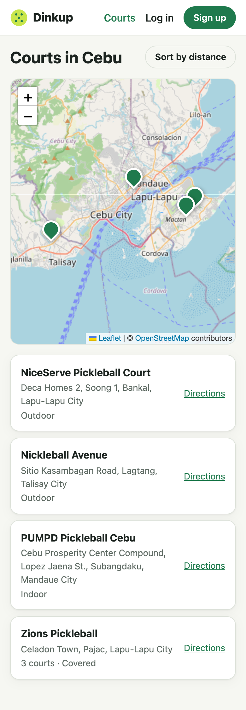
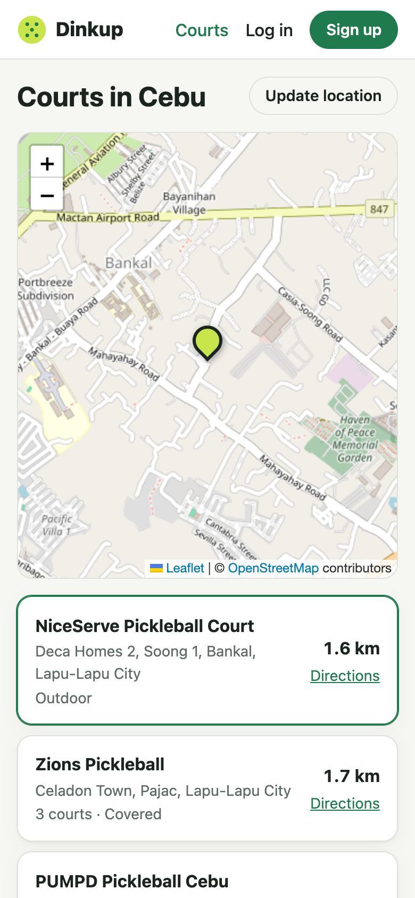

# Step 2 — Courts

**Date:** 2026-09-30

## Prompt

> okay commit now and proceed next step

## What was built

- `courts` table: name, address, city, lat/lng, court count, setting (indoor/outdoor/covered), notes, and `source`, which records where each pin came from. A unique `slug` lets the seed upsert without duplicates.
- `server/prisma/data/courts.ts` plus an idempotent seed script (`npm run db:seed --workspace server`)
- `GET /api/courts` and `GET /api/courts/:id`, public so guests can browse
- `shared/geo.ts`: haversine `distanceKm`, a Google Maps `directionsUrl`, and `CEBU_CENTER`. Game browsing in step 4 reuses them.
- `/courts` page: Leaflet map + list; "Sort by distance" using browser geolocation, only requested when tapped; tapping a court zooms the map to it; directions link
- 7 new tests (24 total)

## Finding real court data

This took the most time, and it's the most honest part of the story.

- **OpenStreetMap** has only three named pickleball venues in Metro Cebu: PUMPD, NiceServe, and Nickleball Avenue.
- **Nominatim** (OSM search) found none of the ~17 venues named in local directories.
- **Local directories** (cebupickleballcourts.com, cebucourtsandclubs.com, sugbo.ph) list ~30 venues but give no coordinates, and they disagree. HQ Pickleball is "outdoor" on one and "9 indoor courts" on another.
- **Pickleheads** blocks scraping (403).
- **Zions Pickleball's own website** embeds a Google Map, and the exact coordinates were in the embed URL.

**Decision:** seed only the four venues with verified pins. The other ~18 are in the data file with `lat: null` and are skipped by the seed. A wrong pin sends a player to the wrong place, which is worse than a missing court. Filling them in means right-clicking the venue in Google Maps and copying the coordinates. That's a job for someone local, not for an AI guessing.

## Decisions worth explaining

- **CSS pins instead of Leaflet's default marker.** The default marker loads PNGs from paths that break under Vite's bundling (the known watch-out from the plan). A `divIcon` avoids the problem and matches the brand.
- **Fit to all courts on load.** A fixed center left the Lapu-Lapu pins off-screen on a phone.
- **Lazy-loaded `/courts` route.** Leaflet added about 150 KB and pushed the bundle past Vite's 500 KB warning. Only people who open the map download it.
- **Geolocation on tap, not on page load.** A permission prompt on arrival is hostile and gets denied.
- **Distance in JS, not PostGIS.** A few dozen courts is nothing to sort.

## What had to be fixed

- **Prisma 7 `migrate dev` no longer runs `generate`.** The seed crashed with `Cannot read properties of undefined (reading 'upsert')` because the client didn't know about `Court` yet. `db:migrate` now runs `prisma migrate dev && prisma generate`.
- **Invisible "Sort by distance" button in light mode.** Step 1's `.button-small` had `color: #fff !important`, a hack for the header's Sign up link, which made ghost-style small buttons white on white. The `!important` wasn't needed (the nav link rule already excludes `.button`), so it was removed. Caught by a screenshot, not by tests.
- **A misleading test.** A distance test was named "Cebu City to Lapu-Lapu is roughly 9–10 km" but asserted 5–6 km, using city-hall coordinates the AI couldn't verify. It was replaced with an exact fact: one degree of latitude is ~111.19 km.
- **"Loading courts…" forever when the API hung.** During testing, Docker (OrbStack) stopped responding and database queries hung with no error. Every API request now has a 15-second timeout with a clear message.
- **React Router `HydrateFallback` warning** on direct visits to a lazy route. Added a root `hydrateFallbackElement`.
- **Headless Chrome screenshots were misleading.** `--window-size=390` renders wider than 390px and crops, so the layout looked broken when it wasn't. Switched to Playwright with real mobile emulation and measured `scrollWidth` (0 px overflow on every page, light and dark).

## Follow-ups

- Add coordinates for the remaining venues in `server/prisma/data/courts.ts`.
- OSM tiles are fine for a portfolio's traffic; switch to a tile provider with an API key if real usage grows.
