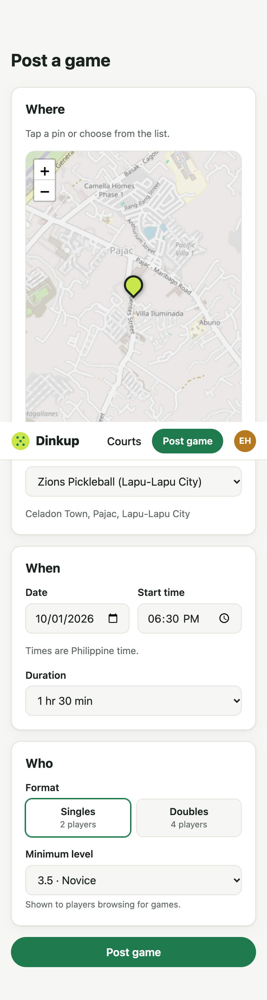
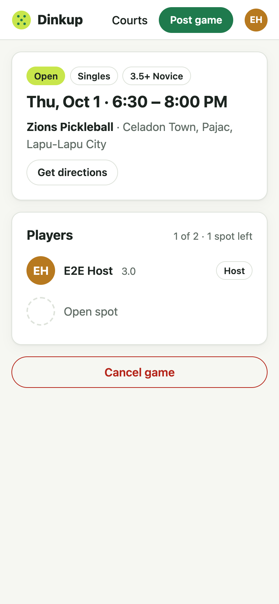

# Step 3 — Post a game

**Date:** 2026-09-30

## Prompt

> yes proceed to step 3

## What was built

- **`games` and `game_players` tables.** The composite primary key `(game_id, user_id)` means nobody can join a game twice. "Full" isn't stored: it's derived from player count vs. capacity, so it can't drift.
- **Hand-written CHECK constraints** in the migration, because Prisma's schema language can't express them: capacity must match the format (2 for singles, 4 for doubles), and duration must be 30–240 minutes in 15-minute steps. A test proves the database rejects a bad row even when the API is bypassed.
- **`POST /api/games`**: validated with a shared Zod schema. The start must be in the future and at most 60 days ahead. Capacity comes from the format, and any `capacity` in the body is ignored. The host is added as the first player in the same transaction.
- **`GET /api/games/:id`**: public, so a shared game link works for guests. It never includes emails.
- **`POST /api/games/:id/cancel`**: host only, and only before the game starts.
- **Rules beyond the plan:**
  - You can't host a game that overlaps one you're already playing in. Back-to-back games are fine.
  - Each user can have at most 5 upcoming hosted games (anti-spam).
- **Shared helpers**: `manilaToIso`, `todayInManila`, `gameEndsAt`, `gameDisplayStatus` (open / full / cancelled / completed, derived when read)
- **Client**:
  - `/games/new`: map + dropdown court picker, date/time in Philippine time, duration, singles/doubles control, minimum level
  - `/games/:id`: time range, badges, directions, players with open-spot placeholders, host cancel
  - "Post a game" links from the header, the home page, and each court
- 16 new tests (40 total)

## Decisions worth explaining

- **Row lock on the user (`SELECT … FOR UPDATE`) inside the create transaction.** The clash check and the 5-game cap are both check-then-insert, so two quick submits could both pass the checks before either inserted. The lock serializes one user's game creation.
  - **Proof it matters:** with the lock commented out, the "two simultaneous overlapping posts" test failed 3 out of 3 runs, and both requests returned 201. With the lock, exactly one gets through every time.
- **Manila time without a timezone library.** The Philippines has no daylight saving, so a date and time from the form map to exactly one instant: `${date}T${time}:00+08:00`. A test checks that 18:30 Manila is stored as 10:30 UTC.
- **The client never sends capacity.** The server derives it from the format, so a crafted request can't create a 10-player "singles" game.
- **The cancel endpoint row-locks the game.** Step 5's join will lock the same row, so a cancel and a join can't interleave.

## What had to be fixed

- **Map crash on `/games/new?court=…`: `Invalid LatLng object: (NaN, NaN)`.** Found by the end-to-end browser test, not by unit tests. Instrumenting Leaflet showed `flyTo` was called twice, the second time while the first animation was still running (zoom 14.1). React StrictMode runs effects twice in development, and Leaflet's fly math produces NaN when a fly starts mid-fly.
  - **Fix:** the effect depends on the court's id and coordinates instead of the object, calls `map.stop()` before flying, and skips if the map is already there. A preselected court now jumps straight to its pin instead of flying.
- **The crash showed React Router's developer error screen.** Added a root `errorElement` with a friendly "Something went wrong" page, a Reload button, and a Home link.
- **Test helper typing.** An `async` helper wrapped supertest's chainable request in a plain Promise, so `.expect()` didn't exist. Removed `async`.
- **The AI wiped real sessions during cleanup.** A test-data cleanup ran `session.deleteMany({})`, which would have logged out real users. Cleanup now deletes only the test accounts' sessions (`sess->>'userId' = ANY(...)`). It's a small mistake, but exactly the kind a production mindset has to catch.

## Follow-ups

- The minimum level is informational for now. Step 5 decides whether joining below it is blocked or just warned.
- Games past their end time show as "Played", but their status isn't written to the database until results arrive in step 10.
