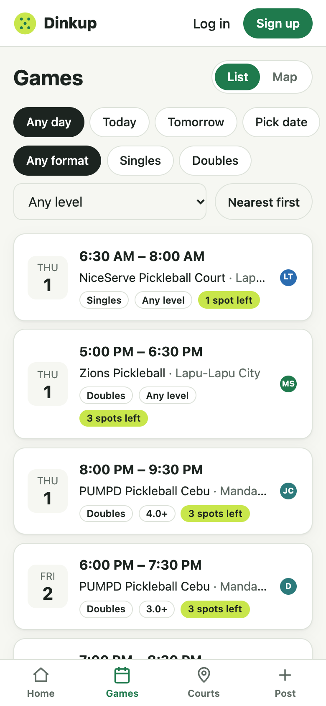
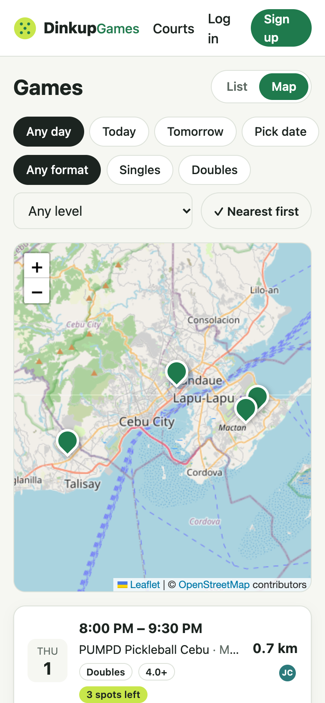
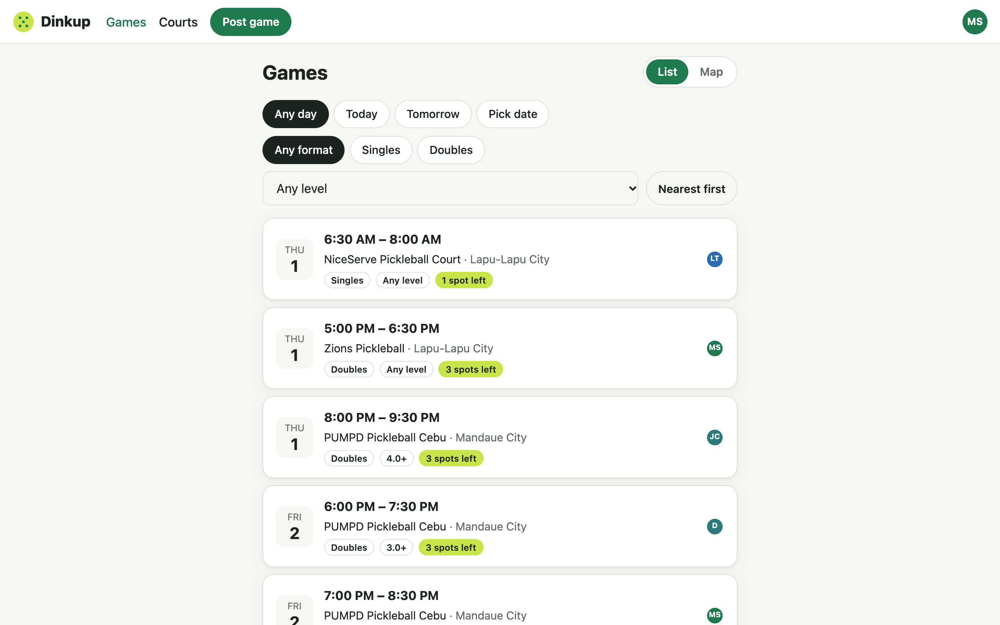
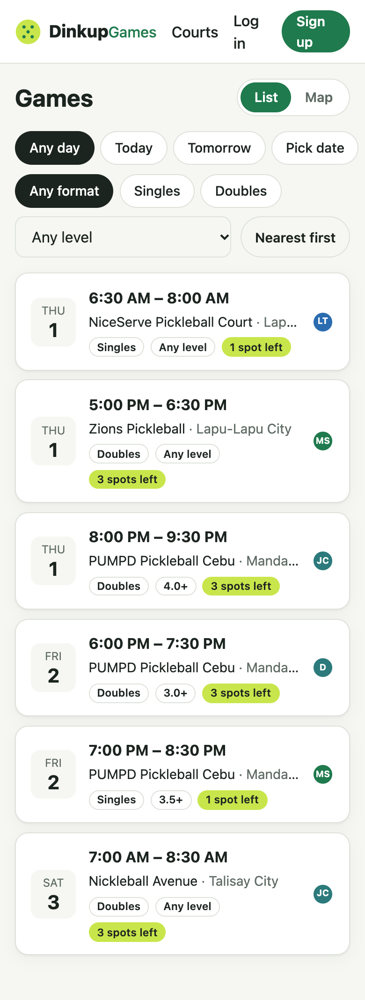

# Step 4 — Browse games

**Date:** 2026-09-30

## Prompt

> blocked for now. then proceed next step

The "blocked" answer settled the step 5 question: players below a game's minimum level can't join. It's recorded in the plan.

## What was built

- **`GET /api/games`** (public): upcoming games that haven't started. Full games stay in the list with a "Full" badge.
  - **Filters:** `date` (a Manila calendar day), `level` (games that level can join), `format`, `near=lat,lng` (adds `distanceKm` and sorts nearest first, soonest breaking ties), `limit`
  - All validated with a shared Zod schema. Malformed filters return 400.
- **Shared helpers:**
  - `meetsMinLevel`: the join rule step 5 will enforce
  - `manilaDayRange` and `addDaysToDate`
- **`/games` page:**
  - Day chips (Any / Today / Tomorrow / pick a date), format chips, a level dropdown, and "Nearest first"
  - List/map toggle. Tapping a court on the map narrows the list to its games.
  - Friendly empty states
- **Filters live in the URL** (`/games?date=…&format=singles&view=map`), so they survive a refresh and the back button, and can be shared. Location is deliberately left out of the URL: it's private and shouldn't travel with a copied link.
- **Home page** shows the next 3 games with a "See all" link.
- **Game card:** date block, time range, court, badges, spots left, distance, player avatars
- **Bottom tab bar on phones** (Home, Games, Courts, Post). On screens 720px and wider, the links move into the header.
- 8 new tests (48 total)

## Decisions worth explaining

- **"Today" is the Manila day, computed on the server.** A test places games at 00:15 and 23:30 Manila on one day and 00:30 the next. 23:30 Manila is 15:30 UTC on the same day, but 00:30 the next day is 16:30 UTC on the *same* UTC day, so a UTC-based filter would wrongly include it.
- **Distance sort vs. the result limit.** The first version took the 50 *soonest* games and then sorted those by distance, which isn't the 50 *nearest*. When sorting by distance, it now fetches a bounded larger set (500), sorts, then cuts. A test with `limit=1` locks this in. The AI caught this one on its own review, before any test failed.
- **Aborting stale requests.** When filters change quickly, the previous `/api/games` request is aborted (the `useGames` hook plus an `AbortSignal` in the API client), so a slow old response can't overwrite a newer one.
- **Leaflet stays lazy.** The map view loads the map code only when someone switches to it.

## What had to be fixed

- **The header broke at phone width.** With a Games link added, the guest header rendered "DinkupGames" with no gap, and "Log in" and "Sign up" each wrapped onto two lines. The automated overflow check still said 0 px, because the text squashed rather than spilling sideways, so only the screenshot caught it. The fix was a bottom tab bar on phones, the standard mobile pattern and a better fit for the PWA in step 8, and it was checked at 320, 390, and 1280 px.
  
- **Test timeouts on Neon.** "Caps upcoming hosted games at 5" makes 6 sequential posts, each a transaction with several round trips to Singapore, and it crossed Vitest's 5-second default. Raised to 20 s with a comment explaining why. The suite now takes about 50 s against Neon, versus about 7 s locally.
- **The e2e script assumed an empty database.** A real game from the developer's own account showed up in the results, and a hard-coded count stalled the script. It now waits for each API response instead of guessing counts, and cleanup only touches `e2e-…@example.com` accounts.

## Follow-ups

- The test suite is slow against a remote database. If it becomes a drag, run tests against a local Postgres or a Neon branch in the same region as CI.
- Seeded demo games (step 7) will make the board look alive for recruiters.
