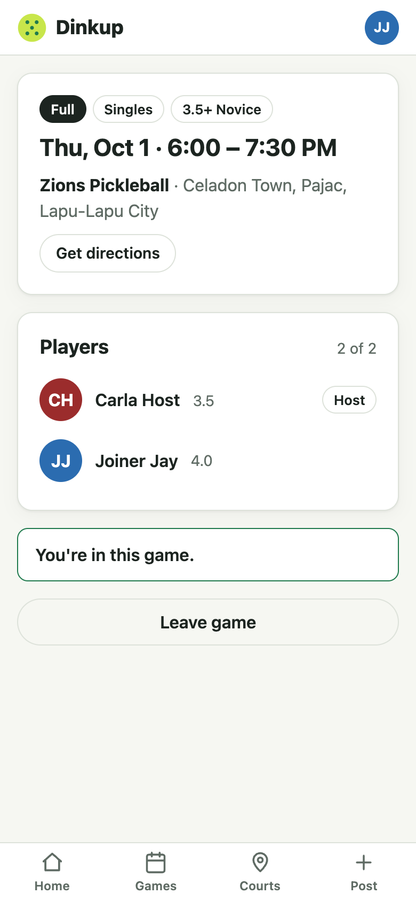
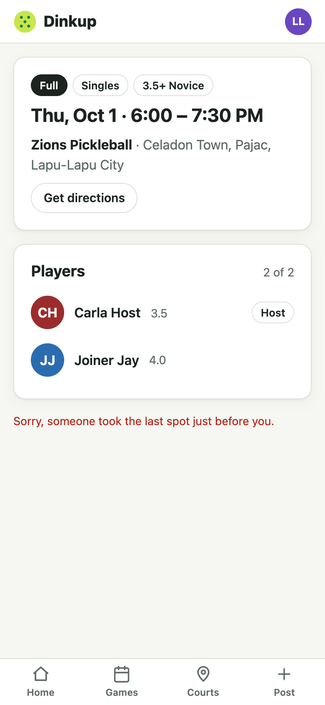

# Step 5 — Join and leave

**Date:** 2026-09-30

## Prompt

> yes please

## What was built

- **`POST /api/games/:id/join`**, checked in this order inside one transaction:
  1. Lock the player's row, then the game's row.
  2. The game isn't cancelled or already started, the player isn't already in it, and it isn't full.
  3. The player meets the minimum level. Below it, they're blocked with a 403, per the decision recorded in the plan.
  4. No schedule clash with another game they're in.
  5. Insert the player.
- **`POST /api/games/:id/leave`**: allowed before the game starts. The host can't leave their own game, because it would be orphaned; hosts cancel instead.
- **`GET /api/games/mine`**: games I'm hosting or playing in that haven't ended, including cancelled ones so players find out.
- **Game page actions**, depending on who's looking:
  - Guest: "Log in to join", which returns to the game after login
  - Below the level: an explanation instead of a button
  - Otherwise: Join; or "You're in" + Leave; or Cancel for the host
- **"You're in" badge** on game cards, and **"Your upcoming games"** on the profile
- 16 new tests (64 total)

## Decisions worth explaining

- **Two locks, always in the same order: user, then game.**
  - The **game** lock stops two people taking the last spot.
  - The **user** lock stops one person joining two overlapping games at once. The clash check reads *other* games, which the game lock doesn't cover.
  - Every code path that takes both locks takes them user first, so two transactions can never wait on each other in a cycle (deadlock). Leave and cancel only need the game lock.
- **Both locks were proven necessary by removing them one at a time:**

  | Lock removed | Test | Result without it (3 runs) |
  |---|---|---|
  | Game lock | Two players join a singles game with one spot left | Both got in, every run: a 3-player singles game |
  | User lock | One player joins two overlapping games at once | Both joins succeeded, every run |

  With the locks in place, exactly one request wins each time.
- **Action responses return the whole updated game.** The page re-renders from the server's state, not from an optimistic guess. If an action fails, the page re-fetches so it shows *why* (full, cancelled).
- **The level check uses the same `meetsMinLevel` function on both sides.** The server enforces it, and the client uses it to explain the block instead of showing a button that would fail.

## What had to be fixed

- **A confusing double message when someone took the last spot.** On a page that had been open a while, clicking Join after another player filled the game showed "This game is full" as a red error *and* as a notice. Caught by the multi-browser e2e test, which opens the page as one player, fills the game as another, then clicks Join as the first. It now shows one message that says what happened: "Sorry, someone took the last spot just before you."

## Follow-ups

- The test suite takes about 105 s against Neon (every query goes to Singapore). A local or same-region test database would bring that back to seconds.
- No notifications yet (out of scope for v1). Hosts see who joined by opening the game.
