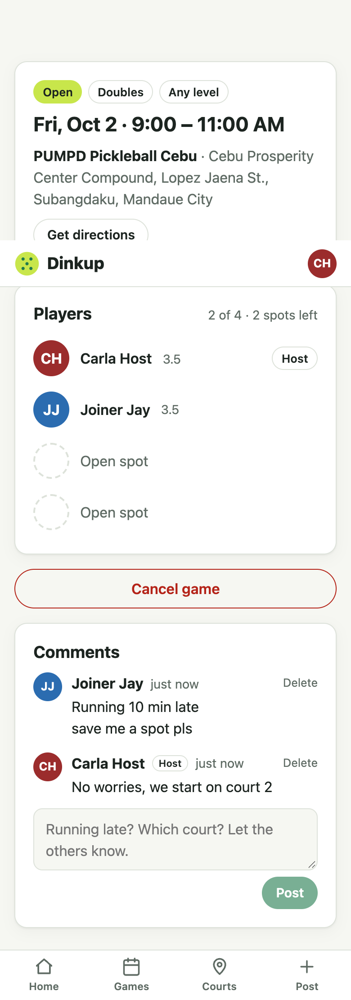

# Step 6 — Game page comments

**Date:** 2026-09-30

## Prompt

> yes please continue

The players list and directions link were already built in steps 3 and 5, so this step is the comment thread.

## What was built

- **`game_comments` table** (≤ 500 characters) with a hand-added CHECK constraint that rejects blank bodies even when the API is bypassed
- **`GET /api/games/:id/comments`**: public, like the game page. Returns the newest 200, shown oldest first, with no emails.
- **`POST /api/games/:id/comments`**: **players only** (host + joined). A player who leaves can't post any more, but their earlier comments stay.
- **`DELETE /api/games/:id/comments/:commentId`**: the author, or the host (moderation). Returns 404 if the comment belongs to a different game than the URL says.
- **Per-user rate limit:** 10 comments a minute.
- **Comment thread on the game page:**
  - Relative times ("just now", "5 min ago")
  - Line breaks kept
  - Cmd/Ctrl+Enter to post
  - A character counter near the limit
  - Delete only where allowed
  - Separate messages for outsiders ("Join the game to comment") and guests
- **Polling every 20 s while the tab is visible**, plus a refresh when the tab comes back. "Running 10 min late" only helps if the others see it without reloading.
- 12 new tests (76 total)

## Decisions worth explaining

- **Who can post: players only.** Letting any logged-in user comment invites spam on every public game, while a comment thread is for coordinating the people playing. Reading stays public because the game page is public.
- **Rate limit per user, not per IP.** Players at the same court often share one Wi-Fi or mobile carrier IP, so an IP limit would block a whole group because of one person. A test checks that one player's burst doesn't block the host.
- **XSS.** Comments are stored as plain text and rendered by React, which escapes them. `dangerouslySetInnerHTML` is never used. A test stores `` unchanged, and the browser test confirms it renders as text with no `` element created.
- **Polling, not WebSockets.** Real-time push is out of scope for v1. A 20-second poll that pauses in background tabs costs little and covers "running late". In the browser test, the host saw a new comment after about 18 s without reloading.
- **Delete checks the game in the URL.** It returns 404 if a comment ID is used through a different game's URL, so a host can't moderate other hosts' games by editing the URL.

## What had to be fixed

- **An Express 5 type error.** `req.params` is typed `string | string[]` in Express 5's types, so a helper typed `Record<string, string>` didn't compile. The helper now takes `unknown` values and validates the id with Zod, which it was doing anyway.
- **A too-eager e2e script.** It read the outsider and guest views before the comments had loaded and reported "Loading…". The app was fine; the script now waits for the comments to render.

No app bugs this step. The server rules were test-first, and the UI worked the first time in the browser test.

## Follow-ups

- The test suite is up to about 155 s against Neon. Worth fixing before it grows further; see the note in step 5.
- Editing comments is out of scope; delete and repost.
