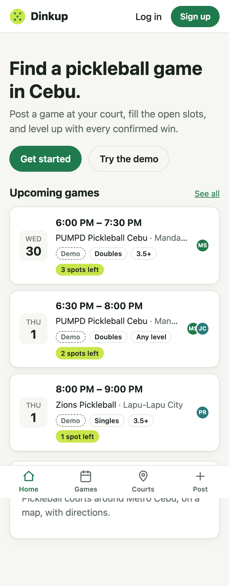
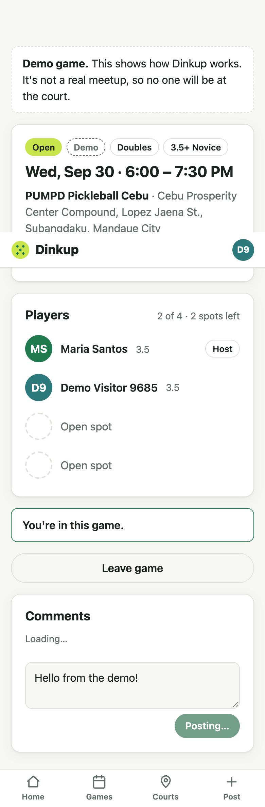

# Step 7 — Demo data

**Date:** 2026-09-30

## Prompt

> yes continue to step 7

## What was built

- **A demo cast of 8 fake players** (`cast.*@demo.dinkup.invalid`). The `.invalid` domain is reserved by RFC 2606, so these addresses can never receive mail. Their passwords are random and thrown away, and their accounts are backdated 60 days so later account-age rules behave realistically.
- **A 7-day cycle of 17 demo game slots** across the 4 pinned courts: different times, formats, and minimum levels, some partly filled, a few with comments.
- **`ensureDemoData()`**:
  - creates any missing demo games for the next 7 days
  - clears demo games that ended more than a day ago
  - deletes demo visitor accounts older than 24 hours
  - never touches real users or their games
  - is idempotent, and runs on server start, hourly, and from `npm run db:seed`
- **"Try the demo"** (`POST /api/auth/demo`, 10 per hour per IP): each click creates a **fresh throwaway account**, logs it in, and joins it to the soonest demo game that has at least 2 open spots, so there's always room for the next visitor.
- **Labels everywhere.** A "Demo" badge on game cards, the game page, and player pages. A banner on demo games: "It's not a real meetup, so no one will be at the court." A notice on a demo profile: "deleted after 24 hours."
- **`DEMO_MODE` env flag** (default `true`) turns all of this off.
- 8 new tests (84 total)

## Decisions worth explaining

- **One account per click, not one shared demo login.** With a shared account, one recruiter's renamed profile or junk game shows up for the next. Throwaway accounts give each visitor a clean sandbox, and hourly cleanup keeps the database small.
- **Labeling is a safety feature, not just UX.** Real Cebu players are invited in step 9. Without the labels, someone could drive to PUMPD for a demo game.
- **Top-up on startup, not a cron job.** Free hosts sleep when idle and wake on the next request. Running on startup (plus hourly while awake) keeps the demo week filled with no external scheduler.
- **The schedule is keyed on the calendar date, not "days from today".** See below.

## What had to be fixed

- **A rolling-schedule bug, caught by the AI rereading its own code before any test ran.** The first version picked each day's slots by *offset from today*. The next day's run would lay "offset 0" over a date that already had yesterday's "offset 1" games, duplicating games and double-booking the cast. It's now keyed on the date (days since epoch, mod 7).
  - **Proof:** with the old logic restored, the "rolls forward day by day" test failed. A cast member was booked into a game starting 30 minutes before their previous one ended.
- **That removal check polluted the dev database.** The developer's own `npm run dev` was running under `tsx watch`, so when `demo.ts` was briefly switched to the buggy version, the dev server reloaded it and ran the top-up against the **dev database**. That produced 31 demo games instead of about 15, with overlaps. The fix deleted only cast-hosted games (no real player had joined one) and regenerated them: 15 games, 0 clashes, real games untouched.
  - **Lesson:** never do removal checks by editing source files while a dev server is watching them. Do them with the dev server stopped, or on a copy.
- **A wrong test expectation.** The first cleanup test expected a visitor to survive a run "10 days later". The code was right to delete it. The test now checks the real boundary: kept at 23 hours, gone at 25.

## Follow-ups

- Once real games exist, add a "Hide demo games" filter.
- The test suite is at about 230 s against Neon (84 tests). A test-only local Postgres would bring that back to seconds.
