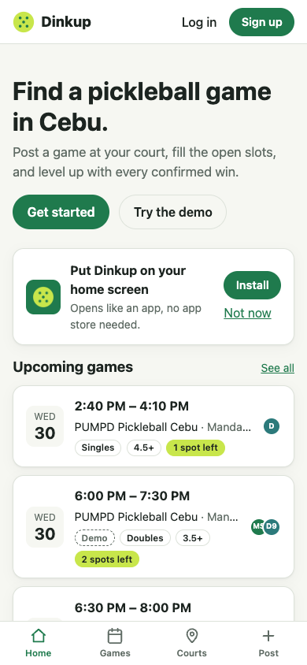
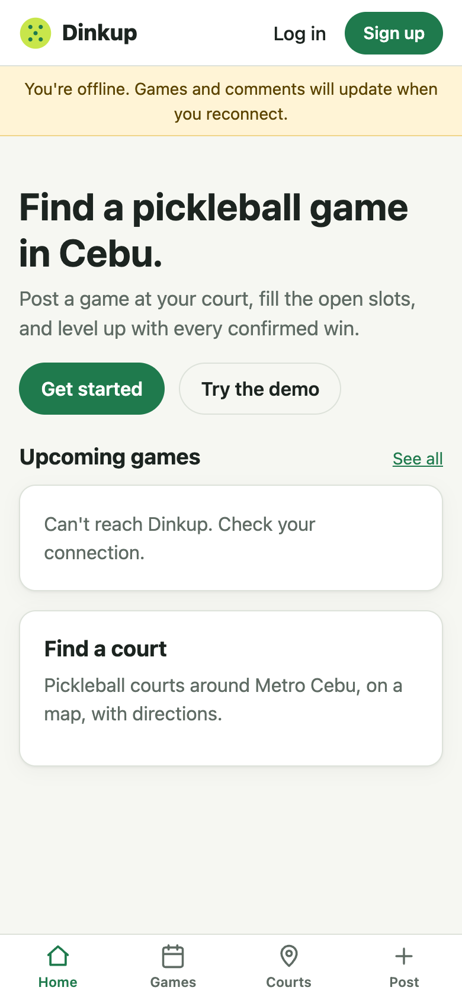
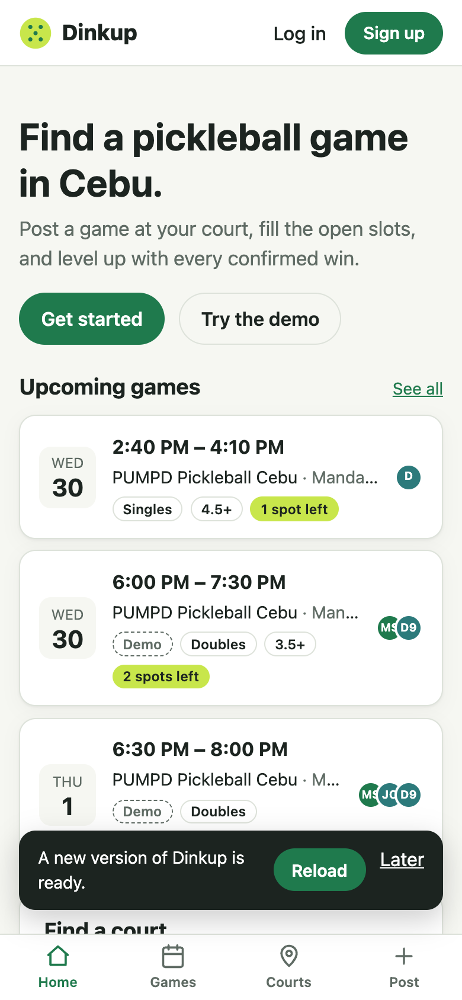

# Step 8 — PWA polish

**Date:** 2026-09-30

## Prompt

> proceed

## What was built

- **Manifest** via `vite-plugin-pwa`: name, `standalone` display, theme colors, and icons (192, 512, maskable 512, 180 Apple touch).
  - The icon is a pickleball on the brand green, drawn inside the maskable safe zone.
  - The PNGs are rendered from `client/icon-src/icon.svg` by headless Chrome (`client/icon-src/render.mjs`), with no image tooling dependency.
- **Service worker** (Workbox): precaches the app shell (23 files, about 645 KB), so Dinkup opens offline. Client routes fall back to the cached `index.html`.
- **`/api/*` is never cached** (network only). A stale player count or game list is worse than a clear "you're offline".
- **Offline banner** in the layout, plus friendly "Can't reach Dinkup" errors on every page. **Every page re-fetches on reconnect** (`useReconnect`), so the banner's promise ("will update when you reconnect") holds.
- **Update prompt:** `registerType: 'prompt'` shows a "New version ready · Reload / Later" toast instead of reloading someone mid-form. Installed apps check for updates hourly.
- **Install banner** on the home page:
  - Chrome and Android: a real **Install** button, using the captured `beforeinstallprompt` event
  - iPhone and iPad Safari (no install API): "Tap Share, then Add to Home Screen"
  - Hidden once installed. "Not now" snoozes it for 14 days, with `localStorage` wrapped in try/catch.
- **Server cache headers:** hashed `/assets/*` get `immutable, max-age=1y`. `index.html`, `sw.js`, the manifest, and icons get `no-cache`, so installed apps pick up new versions.
- **iOS meta tags:** apple-touch-icon, app title, and light/dark `theme-color`.

## How it was verified

Against the **production build** (`npm run build`, then `NODE_ENV=production`), since the service worker doesn't run in dev:

| Check | Result |
|---|---|
| Manifest served as `application/manifest+json`, all icons return 200 | ✓ |
| Service worker controls the page after first load | ✓ |
| Offline: app shell opens on `/`, `/games`, `/courts`, `/games/:id` | ✓ |
| Offline: `/api/health` is a network error, not a cached response | ✓ |
| Back online: every page recovers without a manual reload | ✓ |
| Changed `sw.js` shows the update toast; Reload activates the new worker | ✓ |
| Simulated `beforeinstallprompt` shows Install; clicking calls the native prompt; dismissal snoozes | ✓ |
| iPhone user agent shows the Share-sheet hint | ✓ |
| Cache headers: assets immutable, shell `no-cache` | ✓ |

**Mobile layout sweep:** 12 pages × 320/390 px × light/dark × guest/user (48 page views), checking for page overflow, any button or chip whose text wraps, and visible content past the right edge.

## What had to be fixed

- **Home page stuck on "Loading games…" offline.** It only read `games` from the hook and ignored `error`, so a failed request looked like loading forever. It now shows the error, and a new `useReconnect` hook re-fetches on the `online` event on the home, games, courts, game, and player pages.
- **"Sort by distance" wrapped at 320 px.** The page title and the button didn't fit in 288 px. Buttons now never wrap their text (`white-space: nowrap`), and page headers wrap the button onto its own row instead.
- **Date and time inputs clipped at 320 px** ("09/30/20", "06:00 P"). The automated sweep missed this, because inputs clip their own value and nothing technically overflows; the screenshot caught it. Below 360 px they now stack (246 px each).
- **The sweep's own false positives.** The first version flagged every button: a 44 px tap target is more than 2.6 × a 16 px font. It also flagged text inside ellipsis-truncated court names. It now counts rendered text lines and skips content inside clipping parents.
- **The demo rate limit tripped during testing.** The sweep created more than 10 demo accounts from one IP in an hour and got blocked, which is the limit working as designed. The sweep now reuses one test session.
- **`source .env` broke on the Neon URL's `&`.** Used Node's `--env-file` instead.

## Follow-ups

- OpenStreetMap tiles aren't cached, so the map is blank offline. That respects OSM's tile policy; a keyed tile provider would allow offline tiles.
- Push notifications stay out of scope for v1.
