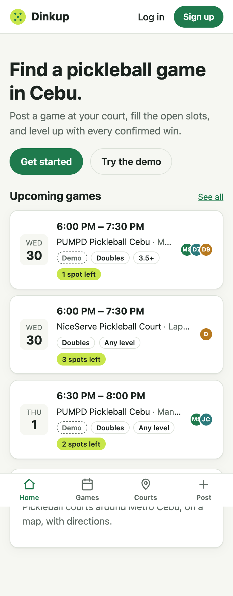

# Step 9 — Deploy

**Date:** 2026-09-30 · **Live:** https://dinkup.onrender.com

## Prompts

> push it for now
> use render and create a separate neon branch

## What was set up

- **GitHub:** the repo was pushed to `dan-medalllojr/dinkup` (public). Before the first push, the whole history was searched for Neon hostnames, passwords, and session secrets, and none were found. `server/.env` has never been tracked.
- **Neon branches:**

  | Branch | Used by | State at launch |
  |---|---|---|
  | `production` | Render (the live site) | Cleaned: 0 users and 0 games; the 4 courts kept. Demo games are generated on boot. |
  | `dev` | Local development and tests (`dinkup_test`) | A full copy of the old data (21 users, 18 games) |

  The connection strings went straight from the Neon CLI into `server/.env` (dev) and a gitignored `server/.env.production.local` (for pasting into Render), and were never printed.
- **Render Blueprint (`render.yaml`):**
  - One free Node web service in Singapore, the same AWS region as Neon
  - Build: `npm ci --include=dev`, build, `prisma migrate deploy`, then the idempotent seed
  - Health check on `/api/health`, auto-deploy on push to `main`
  - Render generates `SESSION_SECRET`; the two database URLs are set in the dashboard, never in git
- **Build dry run:** the Render build was run in a fresh clone with `NODE_ENV=production` before any real deploy, and the production bundle booted and served the app.

## Live checks (after the fix below)

| Check | Result |
|---|---|
| HTTPS, and HTTP 301 → HTTPS | ✓ |
| `index.html`, `sw.js`, manifest `no-cache`; hashed assets immutable | ✓ |
| Service worker controls the page on the real domain (installable) | ✓ |
| Session cookie is `Secure; HttpOnly; SameSite=Lax`, 30 days, behind Render's proxy (`trust proxy`) | ✓ |
| Try the demo, leave and rejoin a game, logout clears the session | ✓ |
| Form-encoded cross-site POST to `/api` rejected (415) | ✓ |
| Live data comes from the `production` branch (all 16 live game IDs found there, none in dev) | ✓ |

## What had to be fixed

- **The first deploy was connected to the dev database.** The live site showed 2 non-demo games, even though production had just been cleaned to zero. Matching the live game IDs against each branch showed that all 17 lived on `dev` and none on `production`: the dashboard had been given the dev strings. The fix was pasting the values from `.env.production.local`, checked by hostname (`ep-summer-bonus…` is production, `ep-green-tooth…` is dev), then redeploying.
  - **Why this matters:** without the ID comparison, the site would have "worked" while real players' data went into the development database.
- **A dev server running since before the branch switch was still writing to production.** `tsx watch` reads `.env` only at startup, so the old process stayed on production and its hourly demo refresh repopulated production's demo games. That was harmless in effect, but it showed that "switching `.env`" doesn't switch running processes. It was stopped and restarted.
- **A check that silently read the wrong database.** An early "production" count ran with two `--env-file` flags, and the later file overrode the earlier one, so it actually read dev. It was caught because it printed the hostname. The destructive cleanup then got a hard guard: it refuses to run unless the host is the production endpoint, and the guard was tested against dev first.
- **Neon CLI side effects.** `neon link` wrote database credentials to `.env.local` and edited `.gitignore`. Both were checked: `.env.local` is covered by `.env.*`, and `.neon` was added to the ignore list.
- **A shell quirk.** `source .env` breaks on the `&` in Neon URLs, so Node's `--env-file` was used instead.

## Operating notes

- Free tier: the Render service sleeps after about 15 minutes idle (the first request then takes up to a minute), and Neon suspends after 5 minutes idle. The demo top-up runs on each boot, which covers the sleeps.
- `server/.env.production.local` holds the production strings. It's gitignored; keep it that way, or delete it once Render has them.
